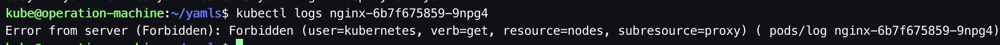

先为kubectl配置`admin user`，以便在之后的部署过程中使用kubectl对k8s集群进行观察和验证。

# 1. 前置步骤

- 完成 [01.前置准备](./01. 前置准备.md)
- 完成 [02. 创建私有CA（单root CA）](./02. 创建私有CA（单root CA）)

&nbsp;

# 2. 为kubectl配置admin user

## 2.1. 创建admin user证书签名请求

```bash
# ssh to operation-machine
$ ssh kube@192.168.1.200

$ mkdir -p /opt/kubernetes/pki/kube-admin/cert

$ vim /opt/kubernetes/pki/kube-admin/kube-admin-csr.json
```

```bash
{
  "CN": "admin",
  "hosts": [],
  "key": {
    "algo": "rsa",
    "size": 2048
  },
  "names": [
    {
      "C": "CN",
      "ST": "Shanghai",
      "L": "Shanghai",
      "O": "system:masters",
      "OU": "System"
    }
  ]
}
```

- 相较于kube-apiserver，kubectl为其客户端，为客户端签发证书可以不指定hosts。

- 证书请求中 O 指定该证书的group为 system:masters，而 RBAC 预定义的 ClusterRoleBinding 将 Group system:masters 与 ClusterRole cluster-admin 绑定，这就赋予了kubectl所有集群权限。

## 2.2. 生成admin user证书和私钥

```bash
# ssh to operation-machine
$ ssh kube@192.168.1.200

$ cfssl gencert \
-ca=/opt/kubernetes/pki/ca/cert/ca.pem \
-ca-key=/opt/kubernetes/pki/ca/cert/ca-key.pem \
-config=/opt/kubernetes/pki/ca/ca-config.json \
-profile=kubernetes /opt/kubernetes/pki/kube-admin/kube-admin-csr.json | cfssljson -bare /opt/kubernetes/pki/kube-admin/cert/kube-admin

$ ls 
... kube-admin-key.pem kube-admin.pem...
```

## 2.3. 生成admin user的kubeconfig

```bash
# ssh to operation-machine
$ ssh kube@192.168.1.200

$ kubectl config set-cluster kubernetes --certificate-authority=/opt/kubernetes/pki/ca/cert/ca.pem --embed-certs=true --server=https://192.168.1.204:6443

$ kubectl config set-credentials admin --client-certificate=/opt/kubernetes/pki/kube-admin/cert/kube-admin.pem --embed-certs=true --client-key=/opt/kubernetes/pki/kube-admin/cert/kube-admin-key.pem

$ kubectl config set-context kubernetes --cluster=kubernetes --user=admin

$ kubectl config use-context kubernetes
```

&nbsp;

# 3. 创建apiserver-to-kubelet-rbac.yaml

创建对应的权限，否则在查看pod日志或进入对应pod执行命令时，会报如下错误。



```bash
# ssh to operation-machine
$ ssh kube@192.168.1.200

$ cat << EOF > apiserver-to-kubelet-rbac.yaml
apiVersion: rbac.authorization.k8s.io/v1
kind: ClusterRole
metadata:
  annotations:
    rbac.authorization.kubernetes.io/autoupdate: "true"
  labels:
    kubernetes.io/bootstrapping: rbac-defaults
  name: system:kube-apiserver-to-kubelet
rules:
  - apiGroups:
      - ""
    resources:
      - nodes/proxy
      - nodes/stats
      - nodes/log
      - nodes/spec
      - nodes/metrics
      - pods/log
    verbs:
      - "*"
---
apiVersion: rbac.authorization.k8s.io/v1
kind: ClusterRoleBinding
metadata:
  name: system:kube-apiserver
  namespace: ""
roleRef:
  apiGroup: rbac.authorization.k8s.io
  kind: ClusterRole
  name: system:kube-apiserver-to-kubelet
subjects:
  - apiGroup: rbac.authorization.k8s.io
    kind: User
    name: kubernetes
EOF

$ kubectl apply -f apiserver-to-kubelet-rbac.yaml
```

&nbsp;

# 4. 参考

1. [Kubernetes - PKI certificates and requirements](https://kubernetes.io/docs/setup/best-practices/certificates/)

2. [Kubernetes - Generate Certificates Manually](https://kubernetes.io/docs/tasks/administer-cluster/certificates/)

3. [Kubernetes - 使用 kubeconfig 文件组织集群访问](https://kubernetes.io/zh-cn/docs/concepts/configuration/organize-cluster-access-kubeconfig/)

4. [kubeasz - 生成 kubeconfig 配置文件](https://github.com/easzlab/kubeasz/blob/master/docs/setup/01-CA_and_prerequisite.md#%E7%94%9F%E6%88%90-kubeconfig-%E9%85%8D%E7%BD%AE%E6%96%87%E4%BB%B6)

5. [kubeasz - Create kubectl-kubeconfig.yml](https://github.com/easzlab/kubeasz/blob/master/roles/deploy/tasks/create-kubectl-kubeconfig.yml)

6. [深入理解kubelet认证和授权](https://www.cnblogs.com/zhongpan/p/11964017.html)

7. [Error from server (Forbidden): Forbidden (user=kubernetes, verb=get, resource=nodes, subresource=proxy) ( pods/log nginx)](https://www.lhl.zone/virtualization/Kubernetes/81.html)
