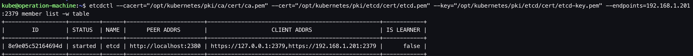
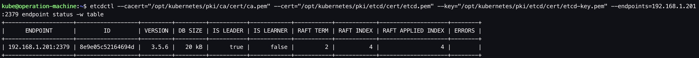
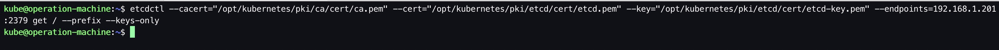

# etcd部署

# 1. 前置步骤

- 完成 [01.前置准备](https://github.com/matribots/k8s-hardcore-deploy-manual/blob/bot-writing/%E9%9D%9E%E9%AB%98%E5%8F%AF%E7%94%A8%E7%89%88/01.%20%E5%89%8D%E7%BD%AE%E5%87%86%E5%A4%87.md)
- 完成 [02. 创建私有CA（单root CA）](https://github.com/matribots/k8s-hardcore-deploy-manual/blob/bot-writing/%E9%9D%9E%E9%AB%98%E5%8F%AF%E7%94%A8%E7%89%88/02.%20%E5%88%9B%E5%BB%BA%E7%A7%81%E6%9C%89CA%EF%BC%88%E5%8D%95root%20CA%EF%BC%89.md)
- 完成 [03. 为kubectl配置admin user](https://github.com/matribots/k8s-hardcore-deploy-manual/blob/bot-writing/%E9%9D%9E%E9%AB%98%E5%8F%AF%E7%94%A8%E7%89%88/03.%20%E4%B8%BAkubectl%E9%85%8D%E7%BD%AEadmin%20user.md)

&nbsp;

# 2. 创建etcd证书签名请求etcd-csr.json

```bash
# ssh to operation-machine
$ ssh kube@192.168.1.200

$ mkdir -p /opt/kubernetes/pki/etcd/cert

$ vim /opt/kubernetes/pki/etcd/etcd-csr.json
```

```json
{
  "CN": "etcd",
  "hosts": [
    "192.168.1.201",
    "127.0.0.1"
  ],
  "key": {
    "algo": "rsa",
    "size": 2048
  },
  "names": [
    {
      "C": "CN",
      "ST": "Shanghai",
      "L": "Shanghai",
      "O": "k8s",
      "OU": "System"
    }
  ]
}
```

&nbsp;

# 3. 生成etcd证书和私钥

```bash
# ssh to operation-machine
$ ssh kube@192.168.1.200

$ cfssl gencert \
-ca=/opt/kubernetes/pki/ca/cert/ca.pem \
-ca-key=/opt/kubernetes/pki/ca/cert/ca-key.pem \
-config=/opt/kubernetes/pki/ca/ca-config.json \
-profile=etcd /opt/kubernetes/pki/etcd/etcd-csr.json | cfssljson -bare /opt/kubernetes/pki/etcd/cert/etcd

$ ls
... etcd.pem etcd-key.pem ...
```

&nbsp;

# 4. 分发etcd证书

将etcd证书、etcd证书私钥分发至etcd的机器上。

```bash
$ ssh kube@192.168.1.200

$ ssh kube@192.168.1.201 "mkdir -p /opt/kubernetes/pki/etcd/cert" && \
  scp /opt/kubernetes/pki/etcd/cert/etcd*.pem kube@192.168.1.201:/opt/kubernetes/pki/etcd/cert/ 
```

&nbsp;

# 5. 启动etcd

具体启动参数请参考官方文档。

```bash
# ssh to etcd-01
$ ssh kube@192.168.1.201

$ sudo /opt/kubernetes/bin/etcd \
  --name=etcd \
  --data-dir=/var/etcd/data \
  --wal-dir=/var/etcd/wal \
  --cert-file=/opt/kubernetes/pki/etcd/cert/etcd.pem \
  --key-file=/opt/kubernetes/pki/etcd/cert/etcd-key.pem \
  --advertise-client-urls=https://192.168.1.201:2379,https://127.0.0.1:2379 \
  --listen-client-urls=https://192.168.1.201:2379,https://127.0.0.1:2379 \
  --snapshot-count=50000 \
  --auto-compaction-retention=1 \
  --auto-compaction-mode=periodic \
  --max-request-bytes=10485760 \
  --quota-backend-bytes=8589934592
```

&nbsp;

# 6. Smoke test

跑一些etcd命令，验证etcd证书是否部署成功。

## 6.1. 查看etcd集群节点列表

```bash
# ssh to operation-machine
$ ssh kube@192.168.1.200

$ etcdctl --cacert="/opt/kubernetes/pki/ca/cert/ca.pem" --cert="/opt/kubernetes/pki/etcd/cert/etcd.pem" --key="/opt/kubernetes/pki/etcd/cert/etcd-key.pem" --endpoints=192.168.1.201:2379 member list -w table
```



## 6.2. 查看etcd集群节点状态

```bash
# ssh to operation-machine
$ ssh kube@192.168.1.200

$ etcdctl --cacert="/opt/kubernetes/pki/ca/cert/ca.pem" --cert="/opt/kubernetes/pki/etcd/cert/etcd.pem" --key="/opt/kubernetes/pki/etcd/cert/etcd-key.pem" --endpoints=192.168.1.201:2379 endpoint status -w table
```



## 6.3. 查看etcd所有的keys

可以看到新建的etcd很干净，还没有任何keys。

```bash
# ssh to operation-machine
$ ssh kube@192.168.1.200

$ etcdctl --cacert="/opt/kubernetes/pki/ca/cert/ca.pem" --cert="/opt/kubernetes/pki/etcd/cert/etcd.pem" --key="/opt/kubernetes/pki/etcd/cert/etcd-key.pem" --endpoints=192.168.1.201:2379 get / --prefix --keys-only
```



&nbsp;

# 7. 配置system service（optional）

步骤5是以命令行的方式启动，以便在部署过程中观察日志并排障。当部署成功且smoke test通过后，可以用system service的方式启动服务，以便测试机器重启后可以自动拉起服务。

## 7.1. 配置etcd系统服务

```bash
# ssh to etcd
$ ssh kube@192.168.1.201

$ sudo vim /etc/systemd/system/etcd.service
```

```bash
[Unit]
Description=Etcd
After=network.target
After=network-online.target
Wants=network-online.target
Documentation=https://github.com/coreos

[Service]
Type=notify
WorkingDirectory=/var/etcd/data
ExecStart=/opt/kubernetes/bin/etcd \
  --name=etcd \
  --data-dir=/var/etcd/data \
  --wal-dir=/var/etcd/wal \
  --cert-file=/opt/kubernetes/pki/etcd/cert/etcd.pem \
  --key-file=/opt/kubernetes/pki/etcd/cert/etcd-key.pem \
  --advertise-client-urls=https://192.168.1.201:2379,https://127.0.0.1:2379 \
  --listen-client-urls=https://192.168.1.201:2379,https://127.0.0.1:2379 \
  --snapshot-count=50000 \
  --auto-compaction-retention=1 \
  --auto-compaction-mode=periodic \
  --max-request-bytes=10485760 \
  --quota-backend-bytes=8589934592
Restart=always
RestartSec=15
LimitNOFILE=65536
OOMScoreAdjust=-999

[Install]
WantedBy=multi-user.target
```

```bash
$ sudo systemctl enable etcd

$ sudo systemctl daemon-reload && sudo systemctl restart etcd
```

&nbsp;

# 8. 参考

1. [kubeasz - etcd csr Ansible template](https://github.com/easzlab/kubeasz/blob/master/roles/etcd/templates/etcd-csr.json.j2)

2. [kubeasz - etcd system service Ansible template](https://github.com/easzlab/kubeasz/blob/master/roles/etcd/templates/etcd.service.j2)

3. [etcd | Clustering Guide - Static](https://etcd.io/docs/v3.5/op-guide/clustering/#static)

4. [etcd | TLS Setup example](https://github.com/etcd-io/etcd/tree/main/hack/tls-setup)

5. [etcd | Transport security model ](https://etcd.io/docs/v3.5/op-guide/security/)
