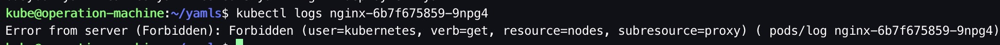
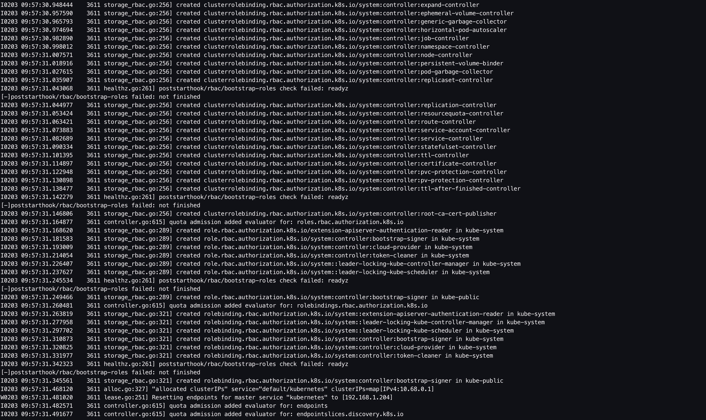
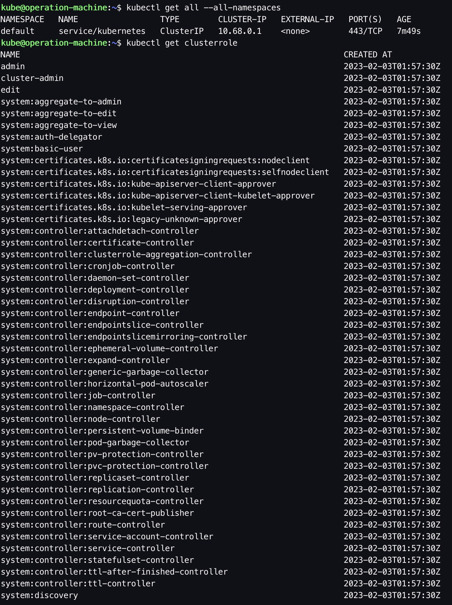
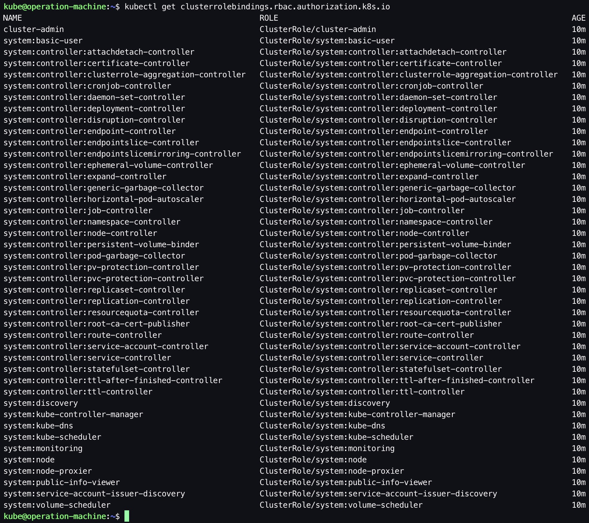
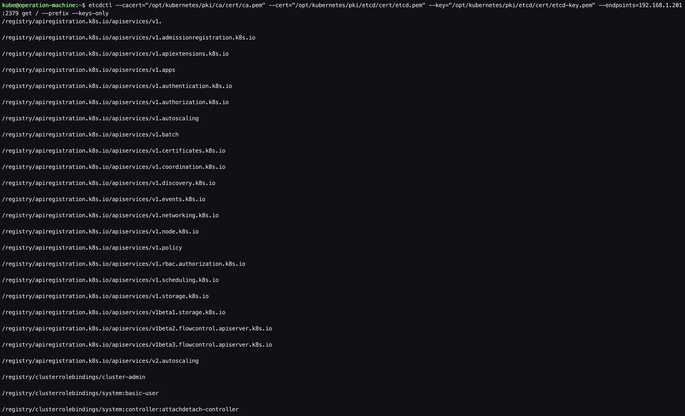
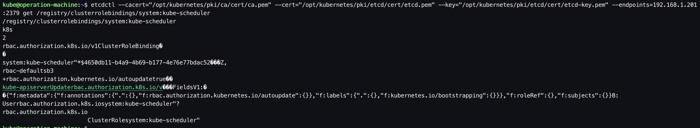
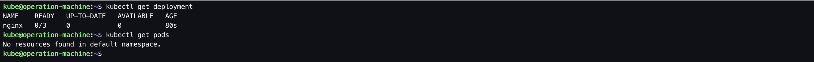
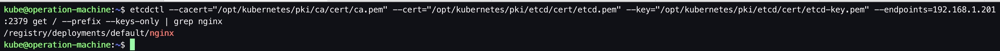
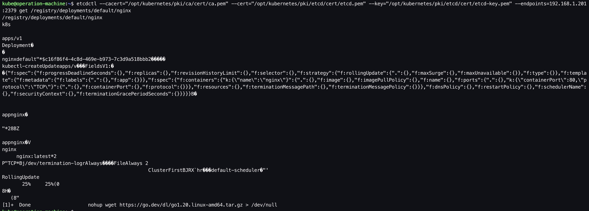
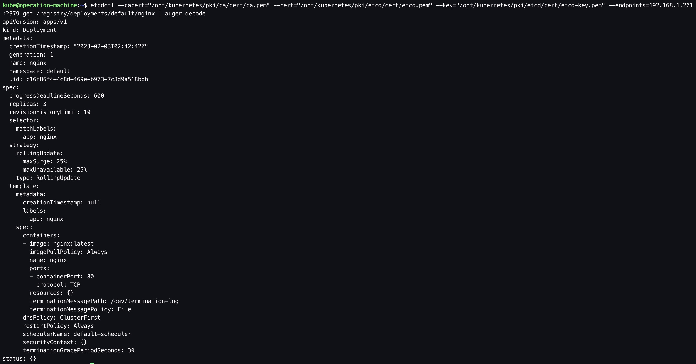

为了方便参考，文档中的一些命令、配置文件中加了注释。在实际部署过程中，需要将这些注释删除，否则运行时会有问题。

&nbsp;

# 1. 前置步骤

- 完成 [01.前置准备](https://github.com/matribots/k8s-hardcore-deploy-manual/blob/bot-writing/%E9%9D%9E%E9%AB%98%E5%8F%AF%E7%94%A8%E7%89%88/01.%20%E5%89%8D%E7%BD%AE%E5%87%86%E5%A4%87.md)

- 完成 [02. 创建私有CA（单root CA）](https://github.com/matribots/k8s-hardcore-deploy-manual/blob/bot-writing/%E9%9D%9E%E9%AB%98%E5%8F%AF%E7%94%A8%E7%89%88/02.%20%E5%88%9B%E5%BB%BA%E7%A7%81%E6%9C%89CA%EF%BC%88%E5%8D%95root%20CA%EF%BC%89.md)
- 完成 [03. 为kubectl配置admin user](https://github.com/matribots/k8s-hardcore-deploy-manual/blob/bot-writing/%E9%9D%9E%E9%AB%98%E5%8F%AF%E7%94%A8%E7%89%88/03.%20%E4%B8%BAkubectl%E9%85%8D%E7%BD%AEadmin%20user.md)
- 完成 [04. control plane部署：etcd](https://github.com/matribots/k8s-hardcore-deploy-manual/blob/bot-writing/%E9%9D%9E%E9%AB%98%E5%8F%AF%E7%94%A8%E7%89%88/04.%20control%20plane%E9%83%A8%E7%BD%B2%EF%BC%9Aetcd.md)

&nbsp;

# 2. 部署kube-apiserver

## 2.1. 创建kube-apiserver证书签名请求

```bash
# ssh to operation-machine
$ ssh kube@192.168.1.200

$ mkdir -p /opt/kubernetes/pki/kube-apiserver/cert

$ vim /opt/kubernetes/pki/kube-apiserver/kube-apiserver-csr.json
```

```json
{
  "CN": "kubernetes",
  "hosts": [
    "127.0.0.1",
    "192.168.1.204",
    "10.68.0.1", // MASTER_CLUSTER_IP (Refer: https://kubernetes.io/docs/tasks/administer-cluster/certificates/)
    "kubernetes",
    "kubernetes.default",
    "kubernetes.default.svc",
    "kubernetes.default.svc.cluster",
    "kubernetes.default.svc.cluster.local"
  ],
  "key": {
    "algo": "rsa",
    "size": 2048
  },
  "names": [
    {
      "C": "CN",
      "ST": "Shanghai",
      "L": "Shanghai",
      "O": "k8s",
      "OU": "System"
    }
  ]
}
```

## 2.2. 生成kube-apiserver集群证书和私钥

```bash
# ssh to operation-machine
$ ssh kube@192.168.1.200

$ cfssl gencert \
-ca=/opt/kubernetes/pki/ca/cert/ca.pem \
-ca-key=/opt/kubernetes/pki/ca/cert/ca-key.pem \
-config=/opt/kubernetes/pki/ca/ca-config.json \
-profile=kubernetes /opt/kubernetes/pki/kube-apiserver/kube-apiserver-csr.json | cfssljson -bare /opt/kubernetes/pki/kube-apiserver/cert/kube-apiserver

$ ls
... kube-apiserver-key.pem  kube-apiserver.pem ...
```

## 2.3. 分发kube-apiserver证书和私钥

```bash
# ssh to operation-machine
$ ssh kube@192.168.1.200

$ ssh kube@192.168.1.204 "mkdir -p /opt/kubernetes/pki/kube-apiserver/cert"

$ scp /opt/kubernetes/pki/kube-apiserver/cert/kube-apiserver*.pem kube@192.168.1.204:/opt/kubernetes/pki/kube-apiserver/cert
```

## 2.4. 启动kube-apiserver

```bash
# ssh to k8s-master-01
$ ssh kube@192.168.1.204

$ sudo /opt/kubernetes/bin/kube-apiserver \
  --allow-privileged=true \
  --anonymous-auth=false \
  --api-audiences=api,istio-ca \
  --authorization-mode=Node,RBAC \
  --bind-address=192.168.1.204 \
  --client-ca-file=/opt/kubernetes/pki/ca/cert/ca.pem \
  --endpoint-reconciler-type=lease \
  # 该部分设置的是：相较于etcd，kube-apiserver作为客户端角色，与etcd通信时所提供的客户端证书
  --etcd-cafile=/opt/kubernetes/pki/ca/cert/ca.pem \
  --etcd-certfile=/opt/kubernetes/pki/kube-apiserver/cert/kube-apiserver.pem \
  --etcd-keyfile=/opt/kubernetes/pki/kube-apiserver/cert/kube-apiserver-key.pem \
  --etcd-servers=192.168.1.201:2379 \
  # 该部分设置的是：相较于kubelet，kube-apiserver作为客户端角色，与kubelet通信时所提供的客户端证书
  --kubelet-certificate-authority=/opt/kubernetes/pki/ca/cert/ca.pem \
  --kubelet-client-certificate=/opt/kubernetes/pki/kube-apiserver/cert/kube-apiserver.pem \
  --kubelet-client-key=/opt/kubernetes/pki/kube-apiserver/cert/kube-apiserver-key.pem \
  --secure-port=6443 \
  --service-account-issuer=https://kubernetes.default.svc \
  --service-account-signing-key-file=/opt/kubernetes/pki/ca/cert/ca-key.pem \
  --service-account-key-file=/opt/kubernetes/pki/ca/cert/ca.pem \
  --service-cluster-ip-range=10.68.0.0/16 \
  --service-node-port-range=30000-32767 \
  --tls-cert-file=/opt/kubernetes/pki/kube-apiserver/cert/kube-apiserver.pem \
  --tls-private-key-file=/opt/kubernetes/pki/kube-apiserver/cert/kube-apiserver-key.pem \
  --requestheader-client-ca-file=/opt/kubernetes/pki/ca/cert/ca.pem \
  --requestheader-allowed-names= \
  --requestheader-extra-headers-prefix=X-Remote-Extra- \
  --requestheader-group-headers=X-Remote-Group \
  --requestheader-username-headers=X-Remote-User \
  #--proxy-client-cert-file=/opt/kubernetes/pki/kubernetes-aggregator-proxy/aggregator-proxy.pem \
  #--proxy-client-key-file=/opt/kubernetes/pki/kubernetes-aggregator-proxy/aggregator-proxy-key.pem \
  --enable-aggregator-routing=true \
  --v=2
```

## 2.5. 创建apiserver-to-kubelet-rbac.yaml

创建对应的权限，否则在查看pod日志或进入对应pod执行命令时，会报如下错误。



```bash
# ssh to operation-machine
$ ssh kube@192.168.1.200

$ cat << EOF > apiserver-to-kubelet-rbac.yaml
apiVersion: rbac.authorization.k8s.io/v1
kind: ClusterRole
metadata:
  annotations:
    rbac.authorization.kubernetes.io/autoupdate: "true"
  labels:
    kubernetes.io/bootstrapping: rbac-defaults
  name: system:kube-apiserver-to-kubelet
rules:
  - apiGroups:
      - ""
    resources:
      - nodes/proxy
      - nodes/stats
      - nodes/log
      - nodes/spec
      - nodes/metrics
      - pods/log
    verbs:
      - "*"
---
apiVersion: rbac.authorization.k8s.io/v1
kind: ClusterRoleBinding
metadata:
  name: system:kube-apiserver
  namespace: ""
roleRef:
  apiGroup: rbac.authorization.k8s.io
  kind: ClusterRole
  name: system:kube-apiserver-to-kubelet
subjects:
  - apiGroup: rbac.authorization.k8s.io
    kind: User
    name: kubernetes
EOF

$ kubectl apply -f apiserver-to-kubelet-rbac.yaml
```

&nbsp;

# 3. Smoke test

## 3.1. 查看kube-apiserver日志

通过kube-apiserver的日志可以发现：kube-apiserver首次启动时，会自动创建一些预设的clusterrole、clusterrolebindings，主要是RBAC权限相关的，供后续别的集群组件接入时，能够有对应的权限。



## 3.2. 通过kubectl查看kube-apiserver的预设资源





## 3.3. 通过etcd查看kube-apiserver的预设资源

etcd是K8s的元数据库。kube-apiserver启动后，预设的K8s资源最终是落在etcd上的，因此现在查看所有etcd keys时，应该是有数据可以查出来的。

```bash
# ssh to operation-machine
$ ssh kube@192.168.1.200

# 查看所有keys
$ etcdctl --cacert="/opt/kubernetes/pki/ca/cert/ca.pem" --cert="/opt/kubernetes/pki/etcd/cert/etcd.pem" --key="/opt/kubernetes/pki/etcd/cert/etcd-key.pem" --endpoints=192.168.1.201:2379 get / --prefix --keys-only
```



```bash
# 列出指定key的值
$ etcdctl --cacert="/opt/kubernetes/pki/ca/cert/ca.pem" --cert="/opt/kubernetes/pki/etcd/cert/etcd.pem" --key="/opt/kubernetes/pki/etcd/cert/etcd-key.pem" --endpoints=192.168.1.201:2379 get /registry/clusterrolebindings/system:kube-scheduler
```



## 3.4. 创建一个Nginx deployment

在执行之前，首先猜想一下：目前只部署了etcd和kube-apiserver，究竟能不能成功创建Deployment？

```bash
# ssh to operation-machine
$ ssh kube@192.168.1.200

$ cat << EOF > nginx-deployment.yaml
apiVersion: apps/v1
kind: Deployment
metadata:
  name: nginx
spec:
  selector:
    matchLabels:
      app: nginx
  replicas: 3
  template:
    metadata:
      labels:
        app: nginx
    spec:
      containers:
      - name: nginx
        image: nginx:latest
        ports:
        - containerPort: 80
EOF

$ kubectl apply -f nginx-deployment.yaml

$ kubectl get deployment && kubectl get pods
```



```bash
# 查看etcd中 nginx deployment keys
$ etcdctl --cacert="/opt/kubernetes/pki/ca/cert/ca.pem" --cert="/opt/kubernetes/pki/etcd/cert/etcd.pem" --key="/opt/kubernetes/pki/etcd/cert/etcd-key.pem" --endpoints=192.168.1.201:2379 get / --prefix --keys-only | grep deployments | grep nginx
```



```bash
# 查看etcd中 nginx deployment keys的值
$ etcdctl --cacert="/opt/kubernetes/pki/ca/cert/ca.pem" --cert="/opt/kubernetes/pki/etcd/cert/etcd.pem" --key="/opt/kubernetes/pki/etcd/cert/etcd-key.pem" --endpoints=192.168.1.201:2379 get /registry/deployments/default/nginx
```



综上，答案是可以的。这里的“**成功创建**”本质上是指kube-apiserver将对应的Deployment元数据成功写入到了etcd里；但由于还没有部署controller manager，对应的Pod还无法在元数据层面上被创建，因此get pod后得到的结果是空的。这说明了kube-apiserver的主要职责之一是：负责对外提供K8s资源元数据的CRUD操作接口（其他的主要职责还有准入控制、鉴权等）。

&nbsp;

# 4. 配置system service（optional）

步骤2.4是以命令行的方式启动，以便在部署过程中观察日志并排障。当部署成功且smoke test通过后，可以用system service的方式启动，以便测试机器重启后可以自动拉起kube-apiserver服务。

```bash
# ssh to k8s-master-01
$ ssh kube@192.168.1.204

$ sudo vim /etc/systemd/system/kube-apiserver.service
```

```bash
[Unit]
Description=Kubernetes API Server
Documentation=https://github.com/GoogleCloudPlatform/kubernetes
After=network.target

[Service]
ExecStart=/opt/kubernetes/bin/kube-apiserver \
  --allow-privileged=true \
  --anonymous-auth=false \
  --api-audiences=api,istio-ca \
  --authorization-mode=Node,RBAC \
  --bind-address=192.168.1.204 \
  --client-ca-file=/opt/kubernetes/pki/ca/cert/ca.pem \
  --endpoint-reconciler-type=lease \
  --etcd-cafile=/opt/kubernetes/pki/ca/cert/ca.pem \
  --etcd-certfile=/opt/kubernetes/pki/kube-apiserver/cert/kube-apiserver.pem \
  --etcd-keyfile=/opt/kubernetes/pki/kube-apiserver/cert/kube-apiserver-key.pem \
  --etcd-servers=192.168.1.201:2379 \
  --kubelet-certificate-authority=/opt/kubernetes/pki/ca/cert/ca.pem \
  --kubelet-client-certificate=/opt/kubernetes/pki/kube-apiserver/cert/kube-apiserver.pem \
  --kubelet-client-key=/opt/kubernetes/pki/kube-apiserver/cert/kube-apiserver-key.pem \
  --secure-port=6443 \
  --service-account-issuer=https://kubernetes.default.svc \
  --service-account-signing-key-file=/opt/kubernetes/pki/ca/cert/ca-key.pem \
  --service-account-key-file=/opt/kubernetes/pki/ca/cert/ca.pem \
  --service-cluster-ip-range=10.68.0.0/16 \
  --service-node-port-range=30000-32767 \
  --tls-cert-file=/opt/kubernetes/pki/kube-apiserver/cert/kube-apiserver.pem \
  --tls-private-key-file=/opt/kubernetes/pki/kube-apiserver/cert/kube-apiserver-key.pem \
  --requestheader-client-ca-file=/opt/kubernetes/pki/ca/cert/ca.pem \
  --requestheader-allowed-names= \
  --requestheader-extra-headers-prefix=X-Remote-Extra- \
  --requestheader-group-headers=X-Remote-Group \
  --requestheader-username-headers=X-Remote-User \
  #--proxy-client-cert-file=/opt/kubernetes/pki/kubernetes-aggregator-proxy/aggregator-proxy.pem \
  #--proxy-client-key-file=/opt/kubernetes/pki/kubernetes-aggregator-proxy/aggregator-proxy-key.pem \
  --enable-aggregator-routing=true \
  --v=2
Restart=always
RestartSec=5
Type=notify
LimitNOFILE=65536

[Install]
WantedBy=multi-user.target
```

```bash
$ sudo systemctl enable kube-apiserver.service

$ sudo systemctl daemon-reload && sudo systemctl restart kube-apiserver.service
```

&nbsp;

# 5. FAQ 

## 5.1. 为什么etcdctl get出来的K8s元数据会有乱码？

在这个回答[etcd v3 can't read encoded values](https://stackoverflow.com/questions/45744534/etcd-v3-cant-read-encoded-values)里指出K8s使用的编码格式为protobuf，因此会输出乱码，可以使用工具[auger](https://github.com/jpbetz/auger)来编码得到可视化信息。在之后的例子中也会使用auger工具来解码查看etcd中的元数据。



&nbsp;

# 6. 参考

1. [Kubernetes - PKI certificates and requirements](https://kubernetes.io/docs/setup/best-practices/certificates/)

2. [Kubernetes - Generate Certificates Manually](https://kubernetes.io/docs/tasks/administer-cluster/certificates/)

3. [Kubernetes - 使用 kubeconfig 文件组织集群访问](https://kubernetes.io/zh-cn/docs/concepts/configuration/organize-cluster-access-kubeconfig/)

4. [kubeasz - 生成 kubeconfig 配置文件](https://github.com/easzlab/kubeasz/blob/master/docs/setup/01-CA_and_prerequisite.md#%E7%94%9F%E6%88%90-kubeconfig-%E9%85%8D%E7%BD%AE%E6%96%87%E4%BB%B6)

5. [kubeasz - kubernetes-csr.json.j2](https://github.com/easzlab/kubeasz/blob/master/roles/kube-master/templates/kubernetes-csr.json.j2)

6. [kubeasz - kube-apiserver.service.j2](https://github.com/easzlab/kubeasz/blob/master/roles/kube-master/templates/kube-apiserver.service.j2)

7. [导出etcd中的kubernetes配置信息](https://www.cnblogs.com/xiaojiluben/p/16734600.html)

8. [etcd v3 can't read encoded values](https://stackoverflow.com/questions/45744534/etcd-v3-cant-read-encoded-values)
