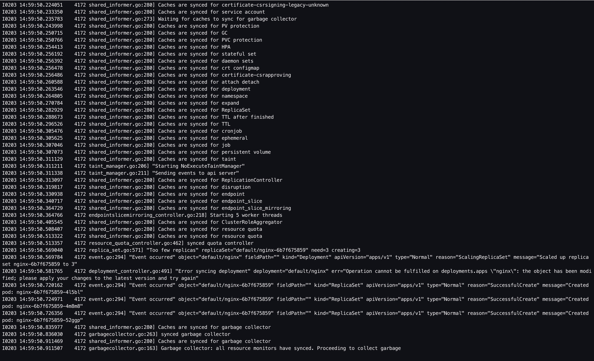
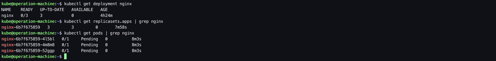
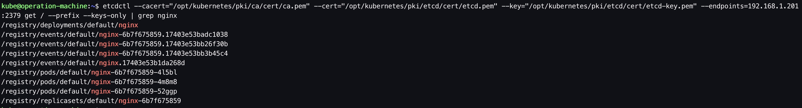

为了方便参考，文档中的一些命令、配置文件中加了注释。在实际部署过程中，需要将这些注释删除，否则运行时会有问题。

&nbsp;

# 1. 前置步骤

- 完成 [01.前置准备](https://github.com/matribots/k8s-hardcore-deploy-manual/blob/bot-writing/%E9%9D%9E%E9%AB%98%E5%8F%AF%E7%94%A8%E7%89%88/01.%20%E5%89%8D%E7%BD%AE%E5%87%86%E5%A4%87.md)
- 完成 [02. 创建私有CA（单root CA）](https://github.com/matribots/k8s-hardcore-deploy-manual/blob/bot-writing/%E9%9D%9E%E9%AB%98%E5%8F%AF%E7%94%A8%E7%89%88/02.%20%E5%88%9B%E5%BB%BA%E7%A7%81%E6%9C%89CA%EF%BC%88%E5%8D%95root%20CA%EF%BC%89.md)
- 完成 [03. 为kubectl配置admin user](https://github.com/matribots/k8s-hardcore-deploy-manual/blob/bot-writing/%E9%9D%9E%E9%AB%98%E5%8F%AF%E7%94%A8%E7%89%88/03.%20%E4%B8%BAkubectl%E9%85%8D%E7%BD%AEadmin%20user.md)
- 完成 [04. control plane部署：etcd](https://github.com/matribots/k8s-hardcore-deploy-manual/blob/bot-writing/%E9%9D%9E%E9%AB%98%E5%8F%AF%E7%94%A8%E7%89%88/04.%20control%20plane%E9%83%A8%E7%BD%B2%EF%BC%9Aetcd.md)
- 完成 [05. control plane部署：kube-apiserver](https://github.com/matribots/k8s-hardcore-deploy-manual/blob/bot-writing/%E9%9D%9E%E9%AB%98%E5%8F%AF%E7%94%A8%E7%89%88/05.%20control%20plane%E9%83%A8%E7%BD%B2%EF%BC%9Akube-apiserver.md)

&nbsp;

# 2.2. 部署kube-controller-manager

## 2.1. 创建kube-controller-manager证书签名请求

```bash
# ssh to operation-machine
$ ssh kube@192.168.1.200

$ mkdir -p /opt/kubernetes/pki/kube-controller-manager/cert

$ vim /opt/kubernetes/pki/kube-controller-manager/kube-controller-manager-csr.json
```

```bash
{
  "CN": "system:kube-controller-manager",
  "hosts": [],
  "key": {
    "algo": "rsa",
    "size": 2048
  },
  "names": [
    {
      "C": "CN",
      "ST": "Shanghai",
      "L": "Shanghai",
      "O": "system:kube-controller-manager",
      "OU": "System"
    }
  ]
}
```

- 相较于`kube-apiserver`，`kube-controller-manager`为其客户端，为客户端签发证书可以不指定`hosts`。

- 证书请求中，`CN`字段代表`kube-controller-manager`在k8s系统中的用户， `O`字段的值代表`kube-controller-manager`在k8s系统中的 group为`system:kube-controller-manager`；而`RBAC`预定义的 ClusterRoleBinding已将用户`system:kube-controller-manager` 与 ClusterRole `system:kube-controller-manager`绑定，这就赋予了kube-controller-manager在集群中对应的权限。

## 2.2. 生成kube-controller-manager证书和私钥

```bash
# ssh to operation-machine
$ ssh kube@192.168.1.200

$ cd /opt/kubernetes/pki/kube-controller-manager/cert

$ cfssl gencert \
-ca=/opt/kubernetes/pki/ca/cert/ca.pem \
-ca-key=/opt/kubernetes/pki/ca/cert/ca-key.pem \
-config=/opt/kubernetes/pki/ca/ca-config.json \
-profile=kubernetes /opt/kubernetes/pki/kube-controller-manager/kube-controller-manager-csr.json | cfssljson -bare /opt/kubernetes/pki/kube-controller-manager/cert/kube-controller-manager

$ ls
... kube-controller-manager-key.pem kube-controller-manager.pem ...
```

## 2.3. 分发kube-controller-manager的证书和私钥

```bash
# ssh to operation-machine
$ ssh kube@192.168.1.200

$ ssh kube@192.168.1.204 "mkdir -p /opt/kubernetes/pki/kube-controller-manager/cert/"

$ scp /opt/kubernetes/pki/kube-controller-manager/cert/kube-controller-manager*.pem kube@192.168.1.204:/opt/kubernetes/pki/kube-controller-manager/cert/
```

## 2.4. 生成kube-controller-manager.kubeconfig

kubeconfig 文件组织有关集群、用户、命名空间和身份认证机制的信息。 kube-apiserver客户端通常使用 kubeconfig 文件来查找选择集群所需的信息，并与集群的 API 服务器进行通信。相对于kube-apiserver，kube-controller-manager、kube-scheduler、kubelet、kubectl都是其客户端。

```bash
# ssh to operation-machine
$ ssh kube@192.168.1.200

$ kubectl config set-cluster kubernetes --certificate-authority=/opt/kubernetes/pki/ca/cert/ca.pem --embed-certs=true --server=https://192.168.1.204:6443 --kubeconfig=/opt/kubernetes/kubeconfig/kube-controller-manager.kubeconfig

$ kubectl config set-credentials kube-controller-manager --client-certificate=/opt/kubernetes/pki/kube-controller-manager/cert/kube-controller-manager.pem --embed-certs=true --client-key=/opt/kubernetes/pki/kube-controller-manager/cert/kube-controller-manager-key.pem --kubeconfig=/opt/kubernetes/kubeconfig/kube-controller-manager.kubeconfig

# 注：--user参数的值和CSR中CN字段的值一致
$ kubectl config set-context default --cluster=kubernetes --user=kube-controller-manager --kubeconfig=/opt/kubernetes/kubeconfig/kube-controller-manager.kubeconfig

$ kubectl config use-context default --kubeconfig=/opt/kubernetes/kubeconfig/kube-controller-manager.kubeconfig
```

## 2.5. 分发kube-controller-manager.kubeconfig

```bash
# ssh to operation-machine
$ ssh kube@192.168.1.200

$ scp /opt/kubernetes/kubeconfig/kube-controller-manager.kubeconfig kube@192.168.1.204:/opt/kubernetes/kubeconfig/kube-controller-manager.kubeconfig
```

## 2.6. 启动kube-controller-manager

```bash
# ssh to k8s-master-01
$ ssh kube@192.168.1.204

$ sudo /opt/kubernetes/bin/kube-controller-manager \
  --allocate-node-cidrs=true \
  --authentication-kubeconfig=/opt/kubernetes/kubeconfig/kube-controller-manager.kubeconfig \
  --authorization-kubeconfig=/opt/kubernetes/kubeconfig/kube-controller-manager.kubeconfig \
  --bind-address=192.168.1.204 \
  --cluster-cidr=172.20.0.0/16 \    # Pod 地址范围
  --cluster-name=kubernetes \
  --cluster-signing-cert-file=/opt/kubernetes/pki/ca/cert/ca.pem \
  --cluster-signing-key-file=/opt/kubernetes/pki/ca/cert/ca-key.pem \
  --kubeconfig=/opt/kubernetes/kubeconfig/kube-controller-manager.kubeconfig \
  --node-cidr-mask-size=24 \
  --root-ca-file=/opt/kubernetes/pki/ca/cert/ca.pem \
  --service-account-private-key-file=/opt/kubernetes/pki/ca/cert/ca-key.pem \
  --service-cluster-ip-range=10.68.0.0/16 \ # Service 地址范围
  --use-service-account-credentials=true \
  --v=2
```

&nbsp;

# 3. Smoke test

## 3.1. 查看kube-controller-manager日志

可以看到deployment controller创建了一个nginx replicaset；nginx replicaset创建了对应的3个Pod（元数据层面）。



## 3.2. 通过kubectl查看nginx deployment

现在可以查询到对应的nginx pod了。由于目前还没有部署kube-scheduler，pod还无法被调度，因此显示的是Pending状态。



## 3.3. 查看etcd中nginx deployment相关的元数据

可以观察到deployment controller创建的相关元数据。

```bash
# ssh to operation-machine
$ ssh 192.168.1.200

$ etcdctl --cacert="/opt/kubernetes/pki/ca/cert/ca.pem" --cert="/opt/kubernetes/pki/etcd/cert/etcd.pem" --key="/opt/kubernetes/pki/etcd/cert/etcd-key.pem" --endpoints=192.168.1.201:2379 get / --prefix --keys-only | grep nginx
```



&nbsp;

# 4. 配置system service（optional）

步骤2是以命令行的方式启动，以便在部署过程中观察日志并排障。当部署成功且`smoke test`通过后，可以用`system service`的方式启动，以便测试机器重启后可以自动拉起`kube-controller-manager`服务。

```bash
# ssh to k8s-master-01
$ ssh kube@192.168.1.204

$ sudo vim /etc/systemd/system/kube-controller-manager.service
```

```bash
[Unit]
Description=Kubernetes Controller Manager
Documentation=https://github.com/GoogleCloudPlatform/kubernetes

[Service]
ExecStart=/opt/kubernetes/bin/kube-controller-manager \
  --allocate-node-cidrs=true \
  --authentication-kubeconfig=/opt/kubernetes/kubeconfig/kube-controller-manager.kubeconfig \
  --authorization-kubeconfig=/opt/kubernetes/kubeconfig/kube-controller-manager.kubeconfig \
  --bind-address=192.168.1.204 \
  --cluster-cidr=172.20.0.0/16 \      # Pod 地址范围
  --cluster-name=kubernetes \
  --cluster-signing-cert-file=/opt/kubernetes/pki/ca/cert/ca.pem \
  --cluster-signing-key-file=/opt/kubernetes/pki/ca/cert/ca-key.pem \
  --kubeconfig=/opt/kubernetes/kubeconfig/kube-controller-manager.kubeconfig \
  --node-cidr-mask-size=24 \
  --root-ca-file=/opt/kubernetes/pki/ca/cert/ca.pem \
  --service-account-private-key-file=/opt/kubernetes/pki/ca/cert/ca-key.pem \
  --service-cluster-ip-range=10.68.0.0/16 \   # Service 地址范围
  --use-service-account-credentials=true \
  --v=2
Restart=always
RestartSec=5

[Install]
WantedBy=multi-user.target
```

```bash
$ sudo systemctl enable kube-controller-manager.service

$ sudo systemctl daemon-reload && sudo systemctl restart kube-controller-manager.service
```

&nbsp;

# 6. 参考

1. [Kubernetes - PKI certificates and requirements](https://kubernetes.io/docs/setup/best-practices/certificates/)
2. [Kubernetes - Generate Certificates Manually](https://kubernetes.io/docs/tasks/administer-cluster/certificates/)
3. [Kubernetes - 使用 kubeconfig 文件组织集群访问](https://kubernetes.io/zh-cn/docs/concepts/configuration/organize-cluster-access-kubeconfig/)
4. [kubeasz - 生成 kubeconfig 配置文件](https://github.com/easzlab/kubeasz/blob/master/docs/setup/01-CA_and_prerequisite.md#%E7%94%9F%E6%88%90-kubeconfig-%E9%85%8D%E7%BD%AE%E6%96%87%E4%BB%B6)
5. [kubeasz Create kube-controller-manager-kubeconfig.yml](https://github.com/easzlab/kubeasz/blob/master/roles/deploy/tasks/create-kube-controller-manager-kubeconfig.yml)
6. [kubeasz - kube-controller-manager.service.j2](https://github.com/easzlab/kubeasz/blob/master/roles/kube-master/templates/kube-controller-manager.service.j2)
