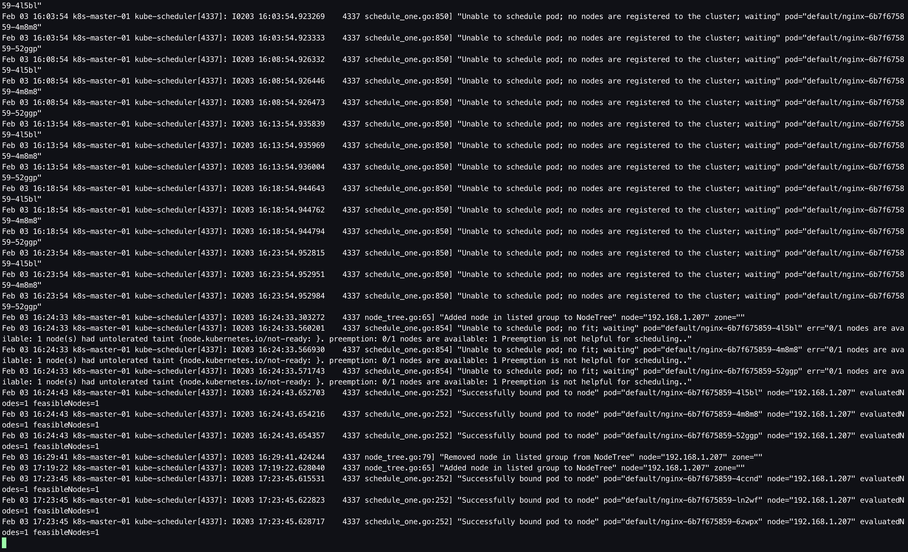
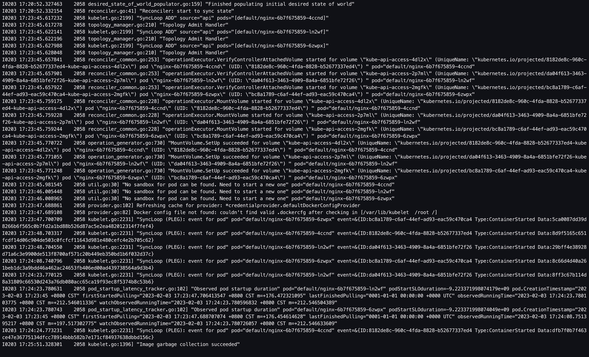
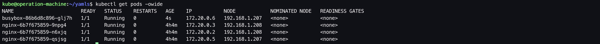
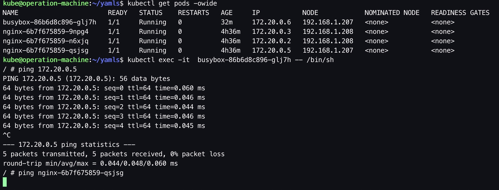
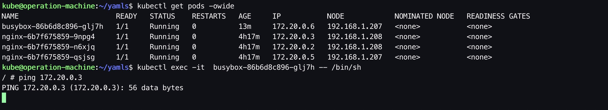
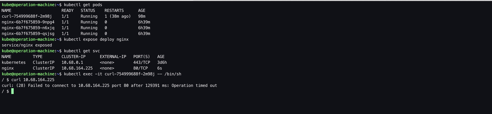

以下**仅用**`k8s-node-01`作为示例，`k8s-node-02`、`k8s-node-03`按照相同的步骤、更换成对应节点的IP地址进行部署。

&nbsp;

# 1. 前置步骤

- 完成 [01.前置准备](./01. 前置准备.md)
- 完成 [02. 创建私有CA（单root CA）](./02. 创建私有CA（单root CA）)
- 完成 [03. 为kubectl配置admin user](./03. 为kubectl配置admin user)
- 完成 [04. control plane部署：etcd](./04. control plane部署：etcd)
- 完成 [05. control plane部署：kube-apiserver](./05. control plane部署：kube-apiserver.md)
- 完成 [06. control plane部署：kube-controller-manager](./06. control plane部署：kube-controller-manager.md)
- 完成 [07. control plane部署：kube-scheduler](./07. control plane部署：kube-scheduler.md)
- 完成 [08. nodes部署：containerd](./08. nodes部署：containerd.md)

&nbsp;

# 2. 创建cni 基础网络插件配置文件（optional）

```bash
# ssh k8s-node-01
$ ssh kube@192.168.1.207

$ vim /etc/cni/net.d/10-default.conf
```

```bash
{
        "name": "mynet",
        "cniVersion": "0.3.1",
        "type": "bridge",
        "bridge": "mynet0",
        "isDefaultGateway": true,
        "ipMasq": true,
        "hairpinMode": true,
        "ipam": {
                "type": "host-local",
                "subnet": "172.20.0.0/16" # 和POD地址网段一致
        }
}
```

&nbsp;

# 3. 安装kubelet

## 3.1. 创建kubelet证书签名请求

由于kubelet证书在签发时，对CN字段值有特殊格式要求，以用于在接入kube-apiserver时，对kubelet进行身份验证及授予预设的角色权限，因此每个kubelet的证书需要单独签发。本文档只以`k8s-node-01`(192.168.1.207)为例，其他节点同理，只需替换对应的节点IP即可。

```bash
# ssh operation-machine
$ ssh kube@192.168.1.200

$ mkdir -p /opt/kubernetes/pki/kubelet/192.168.1.207/cert

$ vim /opt/kubernetes/pki/kubelet/192.168.1.207/kubelet-csr.json
```

```bash
{
  "CN": "system:node:192.168.1.207",
  "hosts": [
    "127.0.0.1",
    "192.168.1.207"
  ],
  "key": {
    "algo": "rsa",
    "size": 2048
  },
  "names": [
    {
      "C": "CN",
      "ST": "Shanghai",
      "L": "Shanghai",
      "O": "system:nodes",
      "OU": "System"
    }
  ]
}
```

## 3.2. 生成kubelet证书和私钥

```bash
# ssh operation-machine
$ ssh kube@192.168.1.200

$ cfssl gencert \
-ca=/opt/kubernetes/pki/ca/cert/ca.pem \
-ca-key=/opt/kubernetes/pki/ca/cert/ca-key.pem \
-config=/opt/kubernetes/pki/ca/ca-config.json \
-profile=kubernetes /opt/kubernetes/pki/kubelet/192.168.1.207/kubelet-csr.json | cfssljson -bare /opt/kubernetes/pki/kubelet/192.168.1.207/cert/kubelet

$ ls 
... kubelet-key.pem kubelet.pem ...
```

## 3.3. 分发kubelet的证书和私钥

```bash
# ssh operation-machine
$ ssh kube@192.168.1.200

$ ssh kube@192.168.1.207 "mkdir -p /opt/kubernetes/pki/kubelet/cert"

$ scp /opt/kubernetes/pki/kubelet/192.168.1.207/cert/kubelet*.pem kube@192.168.1.207:/opt/kubernetes/pki/kubelet/cert/
```

## 3.4. 生成kubelet.kubeconfig

```bash
# ssh operation-machine
$ ssh kube@192.168.1.200

$ kubectl config set-cluster kubernetes --certificate-authority=/opt/kubernetes/pki/ca/cert/ca.pem --embed-certs=true --server=https://192.168.1.204:6443 --kubeconfig=/opt/kubernetes/kubeconfig/kubelet-192.168.1.207.kubeconfig

$ kubectl config set-credentials system:node:192.168.1.207 --client-certificate=/opt/kubernetes/pki/kubelet/192.168.1.207/cert/kubelet.pem --embed-certs=true --client-key=/opt/kubernetes/pki/kubelet/192.168.1.207/cert/kubelet-key.pem --kubeconfig=/opt/kubernetes/kubeconfig/kubelet-192.168.1.207.kubeconfig

$ kubectl config set-context default --cluster=kubernetes --user=system:node:192.168.1.207 --kubeconfig=/opt/kubernetes/kubeconfig/kubelet-192.168.1.207.kubeconfig

$ kubectl config use-context default --kubeconfig=/opt/kubernetes/kubeconfig/kubelet-192.168.1.207.kubeconfig
```

## 3.5. 分发kubelet.kubeconfig

```bash
# ssh operation-machine
$ ssh kube@192.168.1.200

$ scp /opt/kubernetes/kubeconfig/kubelet-192.168.1.207.kubeconfig kube@192.168.1.207:/opt/kubernetes/kubeconfig/kubelet.kubeconfig
```

## 3.6. 创建kubelet的配置文件

```bash
# ssh k8s-node-01
$ ssh kube@192.168.1.207

$ vim /var/lib/kubelet/config.yaml
```

```bash
kind: KubeletConfiguration
apiVersion: kubelet.config.k8s.io/v1beta1
address: 0.0.0.0
authentication:
  anonymous:
    enabled: false
  webhook:
    cacheTTL: 2m0s
    enabled: true
  x509:
    clientCAFile: /opt/kubernetes/pki/ca/cert/ca.pem
authorization:
  mode: Webhook
  webhook:
    cacheAuthorizedTTL: 5m0s
    cacheUnauthorizedTTL: 30s
cgroupDriver: systemd
cgroupsPerQOS: true
clusterDNS:
- 10.68.0.2 # 指定k8s集群内的DNS服务地址，通常是集群Service IP范围的第二个地址。（这个出处需要考证一下）
clusterDomain: cluster.local
configMapAndSecretChangeDetectionStrategy: Watch
containerLogMaxFiles: 3 
containerLogMaxSize: 10Mi
enforceNodeAllocatable:
- pods
eventBurst: 10
eventRecordQPS: 5
evictionHard:
  imagefs.available: 15%
  memory.available: 300Mi
  nodefs.available: 10%
  nodefs.inodesFree: 5%
evictionPressureTransitionPeriod: 5m0s
failSwapOn: true
fileCheckFrequency: 40s
hairpinMode: hairpin-veth 
healthzBindAddress: 0.0.0.0
healthzPort: 10248
httpCheckFrequency: 40s
imageGCHighThresholdPercent: 85
imageGCLowThresholdPercent: 80
imageMinimumGCAge: 2m0s
kubeAPIBurst: 100
kubeAPIQPS: 50
makeIPTablesUtilChains: true
maxOpenFiles: 1000000
maxPods: 110
nodeLeaseDurationSeconds: 40
nodeStatusReportFrequency: 1m0s
nodeStatusUpdateFrequency: 10s
oomScoreAdj: -999
podPidsLimit: -1
port: 10250
# disable readOnlyPort 
readOnlyPort: 0
resolvConf: /run/systemd/resolve/resolv.conf
runtimeRequestTimeout: 2m0s
serializeImagePulls: true
streamingConnectionIdleTimeout: 4h0m0s
syncFrequency: 1m0s
tlsCertFile: /opt/kubernetes/pki/kubelet/cert/kubelet.pem
tlsPrivateKeyFile: /opt/kubernetes/pki/kubelet/cert/kubelet-key.pem
```

## 3.7. 启动kubelet

```bash
# ssh k8s-node-01
$ ssh kube@192.168.1.207

$ sudo /opt/kubernetes/bin/kubelet \
  --config=/var/lib/kubelet/config.yaml \
  --container-runtime-endpoint=unix:///run/containerd/containerd.sock \
  --hostname-override=192.168.1.207 \
  --kubeconfig=/opt/kubernetes/kubeconfig/kubelet.kubeconfig \
  --root-dir=/var/lib/kubelet \
  --v=2
```

&nbsp;

# 4. Smoke test

## 4.1. 观察kube-scheduler日志

观察kube-scheduler的日志，可以发现kube-scheduler发现了可调度的node，并在元数据层面将pod绑定至目标节点上。



## 4.2. 观察kubelet日志

观察kubelet的日志，可以发现kubelet已经发现有对应的Pod指定到自己的节点上，开始创建实际的容器。



## 4.3. 观察pod运行情况

登录operation-machine，部署一个busybox，用于后续的网络测试；通过kubectl查看pod，可以发现pod均已经被成功调度并运行。



## 4.4. 简单网络测试

进入busybox pod，ping `172.20.0.5`，能够ping通，因为pod `busybox-86b6d8c896-glj7h` 和pod `nginx-6b7f675859-qsjsg`位于同一个work node `192.168.1.207`；但是直接ping `nginx-6b7f675859-qsjsg`却不能够ping通，因为此时还未部署DNS插件。



进入busybox pod，ping `172.20.0.3`，不能够ping通，因为pod `busybox-86b6d8c896-glj7h` 和pod `nginx-6b7f675859-9npg4`位于不同的work node，原因是由于CNI网络插件还未部署，跨节点间的pod网络通信还无法实现。



创建nginx服务、部署curl pod并进入，curl nginx服务的集群内部IP地址， 没有返回结果，原因是kube-proxy还未部署。

&nbsp;

至此，kubelet配置完毕。之前处于Pending状态的Pod被成功调度并running。但是此时由于kube-proxy还未配置，因此kube service的功能也无法实现；Calico网络插件也还未配置，跨节点的nginx pod之间的通信还无法实现；DNS插件也还未部署，在K8s集群内也无法直接通过域名访问服务。

&nbsp;

# 5. 配置system service（optional）

步骤3.7是以命令行的方式启动，以便在部署过程中观察日志并排障。当部署成功且`smoke test`通过后，可以用`system service`的方式启动，以便测试机器重启后可以自动拉起`kubelet`服务。

```bash
# ssh k8s-node-01
$ ssh kube@192.168.1.207

$ sudo vim /etc/systemd/system/kubelet.service
```

```bash
[Unit]
Description=Kubernetes Kubelet
Documentation=https://github.com/GoogleCloudPlatform/kubernetes

[Service]
WorkingDirectory=/var/lib/kubelet

ExecStart=/opt/kubernetes/bin/kubelet \
  --config=/var/lib/kubelet/config.yaml \
  --container-runtime-endpoint=unix:///run/containerd/containerd.sock \
  --hostname-override=192.168.1.207 \
  --kubeconfig=/opt/kubernetes/kubeconfig/kubelet.kubeconfig \
  --root-dir=/var/lib/kubelet \
  --v=2

Restart=always
RestartSec=5

[Install]
WantedBy=multi-user.target
```

```bash
$ sudo systemctl enable kubelet.service

$ sudo systemctl daemon-reload && sudo systemctl restart kubelet.service
```

&nbsp;

# 6. 参考

1. [kubeasz - install_kube_node.md](https://github.com/easzlab/kubeasz/blob/master/docs/setup/05-install_kube_node.md)
2. [kubeasz - kube-node Ansible roles](https://github.com/easzlab/kubeasz/tree/master/roles/kube-node)
3. [kubeasz - tasks Ansible role, sign cert](https://github.com/easzlab/kubeasz/blob/master/roles/deploy/tasks/main.yml)
4. [Kubernetes - Set Kubelet parameters via a config file](https://kubernetes.io/docs/tasks/administer-cluster/kubelet-config-file/)
