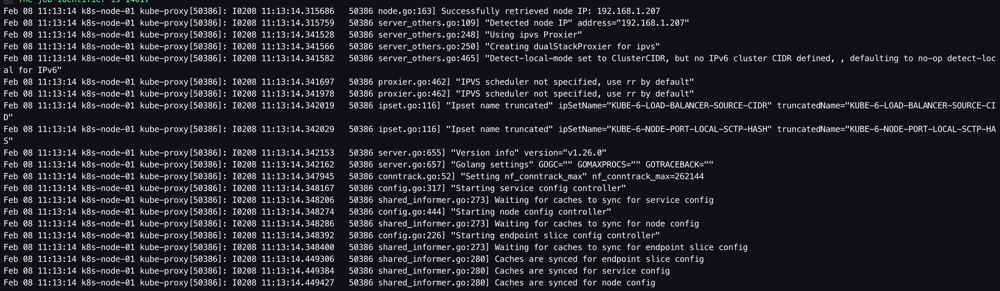
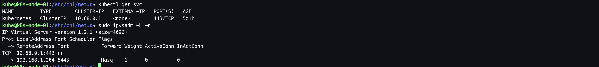

必须在部署calico网络插件之间先部署kube-proxy，因为部署calico时，calico需要用到kube service来访问apiserver。若kube-proxy没有部署完成，在部署Calico时会遇到问题。

&nbsp;

# 1. 前置步骤

- [完成 01.前置准备](https://github.com/matribots/k8s-hardcore-deploy-manual/blob/main/%E9%AB%98%E5%8F%AF%E7%94%A8%E7%89%88/01.%20%E5%89%8D%E7%BD%AE%E5%87%86%E5%A4%87.md)
- [完成 02. 创建私有CA（单root CA）](https://github.com/matribots/k8s-hardcore-deploy-manual/blob/main/%E9%AB%98%E5%8F%AF%E7%94%A8%E7%89%88/02.%20%E5%88%9B%E5%BB%BA%E7%A7%81%E6%9C%89CA%EF%BC%88%E5%8D%95root%20CA%EF%BC%89.md)
- [完成 03. 配置loadbalancer](https://github.com/matribots/k8s-hardcore-deploy-manual/blob/main/%E9%AB%98%E5%8F%AF%E7%94%A8%E7%89%88/03.%20%E9%85%8D%E7%BD%AEloadbalancer.md)
- [完成 04. 为kubectl配置admin user](https://github.com/matribots/k8s-hardcore-deploy-manual/blob/main/%E9%AB%98%E5%8F%AF%E7%94%A8%E7%89%88/04.%20%E4%B8%BAkubectl%E9%85%8D%E7%BD%AEadmin%20user.md)
- [完成 05. control plane部署：etcd集群部署](https://github.com/matribots/k8s-hardcore-deploy-manual/blob/main/%E9%AB%98%E5%8F%AF%E7%94%A8%E7%89%88/05.%20control%20plane%E9%83%A8%E7%BD%B2%EF%BC%9Aetcd%E9%9B%86%E7%BE%A4%E9%83%A8%E7%BD%B2.md)
- [完成 06. control plane部署：kube-apiserver](https://github.com/matribots/k8s-hardcore-deploy-manual/blob/main/%E9%AB%98%E5%8F%AF%E7%94%A8%E7%89%88/06.%20control%20plane%E9%83%A8%E7%BD%B2%EF%BC%9Akube-apiserver.md)
- [完成 07. control plane部署：kube-controller-manager](https://github.com/matribots/k8s-hardcore-deploy-manual/blob/main/%E9%AB%98%E5%8F%AF%E7%94%A8%E7%89%88/07.%20control%20plane%E9%83%A8%E7%BD%B2%EF%BC%9Akube-controller-manager.md)
- [完成 08. control plane部署：kube-scheduler](https://github.com/matribots/k8s-hardcore-deploy-manual/blob/main/%E9%AB%98%E5%8F%AF%E7%94%A8%E7%89%88/08.%20control%20plane%E9%83%A8%E7%BD%B2%EF%BC%9Akube-scheduler.md)
- [完成 09. nodes部署：containerd](https://github.com/matribots/k8s-hardcore-deploy-manual/blob/main/%E9%AB%98%E5%8F%AF%E7%94%A8%E7%89%88/09.%20nodes%E9%83%A8%E7%BD%B2%EF%BC%9Acontainerd.md)
- [完成 10. nodes部署：kubelet](https://github.com/matribots/k8s-hardcore-deploy-manual/blob/main/%E9%AB%98%E5%8F%AF%E7%94%A8%E7%89%88/10.%20nodes%E9%83%A8%E7%BD%B2%EF%BC%9Akubelet.md)

&nbsp;

# 2. 安装kube-proxy

## 2.1. 创建kube-proxy证书签名请求

由于kubelet证书在签发时，对CN字段有特殊格式要求，以用于在接入kube-apiserver时，进行身份验证及授予预设的角色权限，因此此处的CN字段值为system:kube-proxy。

```bash
# ssh operation-machine
$ ssh kube@192.168.1.200

$ mkdir -p /opt/kubernetes/pki/kube-proxy/cert

$ vim /opt/kubernetes/pki/kube-proxy/kube-proxy-csr.json
```

```bash
{
  "CN": "system:kube-proxy",
  "hosts": [],
  "key": {
    "algo": "rsa",
    "size": 2048
  },
  "names": [
    {
      "C": "CN",
      "ST": "Shanghai",
      "L": "Shanghai",
      "O": "k8s",
      "OU": "System"
    }
  ]
}
```

## 2.2. 创建kube-proxy证书和私钥

```bash
# ssh operation-machine
$ ssh kube@192.168.1.200

$ cfssl gencert \
-ca=/opt/kubernetes/pki/ca/cert/ca.pem \
-ca-key=/opt/kubernetes/pki/ca/cert/ca-key.pem \
-config=/opt/kubernetes/pki/ca/ca-config.json \
-profile=kubernetes /opt/kubernetes/pki/kube-proxy/kube-proxy-csr.json | cfssljson -bare /opt/kubernetes/pki/kube-proxy/cert/kube-proxy

$ ls /opt/kubernetes/pki/kube-proxy/cert/
... kube-proxy-key.pem  kube-proxy.pem ...
```

## 2.3. 生成kube-proxy.kubeconfig

```bash
# ssh operation-machine
$ ssh kube@192.168.1.200

$ kubectl config set-cluster kubernetes --certificate-authority=/opt/kubernetes/pki/ca/cert/ca.pem --embed-certs=true --server=https://192.168.1.210:6443 --kubeconfig=/opt/kubernetes/kubeconfig/kube-proxy.kubeconfig

$ kubectl config set-credentials kube-proxy --client-certificate=/opt/kubernetes/pki/kube-proxy/cert/kube-proxy.pem --embed-certs=true --client-key=/opt/kubernetes/pki/kube-proxy/cert/kube-proxy-key.pem --kubeconfig=/opt/kubernetes/kubeconfig/kube-proxy.kubeconfig

$ kubectl config set-context default --cluster=kubernetes --user=kube-proxy --kubeconfig=/opt/kubernetes/kubeconfig/kube-proxy.kubeconfig

$ kubectl config use-context default --kubeconfig=/opt/kubernetes/kubeconfig/kube-proxy.kubeconfig
```

## 2.4.分发kube-proxy.kubeconfig

分发至各work node。

```bash
# ssh operation-machine
$ ssh kube@192.168.1.200

$ scp /opt/kubernetes/kubeconfig/kube-proxy.kubeconfig kube@192.168.1.207:/opt/kubernetes/kubeconfig/kube-proxy.kubeconfig && \
  scp /opt/kubernetes/kubeconfig/kube-proxy.kubeconfig kube@192.168.1.208:/opt/kubernetes/kubeconfig/kube-proxy.kubeconfig && \
  scp /opt/kubernetes/kubeconfig/kube-proxy.kubeconfig kube@192.168.1.209:/opt/kubernetes/kubeconfig/kube-proxy.kubeconfig
```

## 2.5. 创建kube-proxy的配置文件

在每个节点上创建kube-proxy配置文件。本文档只以`k8s-node-01`(192.168.1.207)为例，其他节点同理，只需替换对应的节点IP即可。

```bash
# ssh k8s-node-01
$ ssh 192.168.1.207

$ vim /var/lib/kube-proxy/kube-proxy-config.yaml
```

```bash
kind: KubeProxyConfiguration
apiVersion: kubeproxy.config.k8s.io/v1alpha1
bindAddress: 0.0.0.0
clientConnection:
  kubeconfig: "/opt/kubernetes/kubeconfig/kube-proxy.kubeconfig"
# clusterCIDR即Pod IP地址的范围。根据clusterCIDR判断集群内部和外部流量，配置clusterCIDR选项后，kube-proxy 会对访问Service IP的请求做SNAT
clusterCIDR: "172.20.0.0/16" 
conntrack:
  maxPerCore: 32768
  min: 131072
  tcpCloseWaitTimeout: 1h0m0s
  tcpEstablishedTimeout: 24h0m0s
healthzBindAddress: 0.0.0.0:10256
# hostnameOverride值必须与kubelet启动参数中的值对应一致，否则 kube-proxy启动后会找不到该Node，从而不会创建任何iptables规则
hostnameOverride: "192.168.1.207"
metricsBindAddress: 0.0.0.0:10249
mode: "ipvs"
```

## 2.6. 启动kube-proxy

```bash
$ sudo /opt/kubernetes/bin/kube-proxy --config=/var/lib/kube-proxy/kube-proxy-config.yaml
```

&nbsp;

# 3. Smoke test

## 3.1. 观察日志

启动成功，没有明显报错。



## 3.2. 查看IPVS规则

执行`sudo ipvsadm -L -n`查看防火墙转发规则，可以看到kube-proxy已经添加了kubernetes service的转发规则，说明kube-proxy已经正常启动并工作。



&nbsp;

# 4. 配置system service（optional）

在每个节点上创建kube-proxy系统服务。本文档只以`k8s-node-01`(192.168.1.207)为例。步骤2.6是以命令行的方式启动，以便在部署过程中观察日志并排障。当部署成功且`smoke test`通过后，可以用`system service`的方式启动，以便测试机器重启后可以自动拉起`kube-proxy`服务。

```bash
# ssh k8s-node-01
$ ssh kube@192.168.1.207

$ sudo vim /etc/systemd/system/kube-proxy.service
```

```bash
[Unit]
Description=Kubernetes Kube-Proxy Server
Documentation=https://github.com/GoogleCloudPlatform/kubernetes
After=network.target

[Service]
WorkingDirectory=/var/lib/kube-proxy
ExecStart=/opt/kubernetes/bin/kube-proxy \
  --config=/var/lib/kube-proxy/kube-proxy-config.yaml
Restart=always
RestartSec=5
LimitNOFILE=65536

[Install]
WantedBy=multi-user.target
```

```bash
$ sudo systemctl enable kube-proxy.service

$ sudo systemctl daemon-reload && sudo systemctl restart kube-proxy.service
```

&nbsp;

# 5. 参考

1. [kubeasz - install_kube_node.md](https://github.com/easzlab/kubeasz/blob/master/docs/setup/05-install_kube_node.md)
2. [kubeasz - kube-node Ansible roles](https://github.com/easzlab/kubeasz/tree/master/roles/kube-node)
3. [kubeasz - tasks Ansible role, sign cert](https://github.com/easzlab/kubeasz/blob/master/roles/deploy/tasks/main.yml)
4. [kubeasz - create-kube-proxy-kubeconfig.yml](https://github.com/easzlab/kubeasz/blob/master/roles/deploy/tasks/create-kube-proxy-kubeconfig.yml)
5. [kubeasz - deploy Ansible roles](https://github.com/easzlab/kubeasz/tree/master/roles/deploy)
6. [kubeasz - Create kube-proxy-kubeconfig.yml](https://github.com/easzlab/kubeasz/blob/master/roles/deploy/tasks/create-kube-proxy-kubeconfig.yml)
