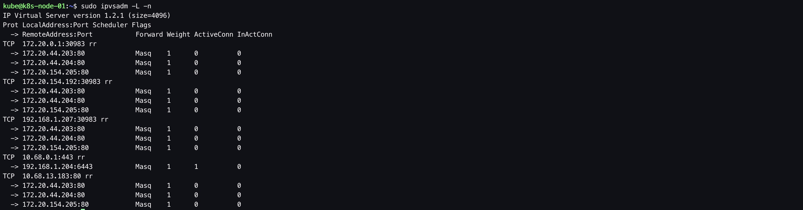

为Kubernetes部署Calico网络从步骤上来说是比较简单的 —— 如果仅仅是为了用Calico部署一个可用的k8s网络，只要修改对应的参数并创建对应的K8s CRD资源即可。本文档只描述部署一个可用的k8s calico网络的部署；关于k8s网络模型、calico的组网原理、参数调优等，需要自行去深入了解。

&nbsp;

# 1. 前置步骤

- [完成 01.前置准备](https://github.com/matribots/k8s-hardcore-deploy-manual/blob/main/%E9%AB%98%E5%8F%AF%E7%94%A8%E7%89%88/01.%20%E5%89%8D%E7%BD%AE%E5%87%86%E5%A4%87.md)
- [完成 02. 创建私有CA（单root CA）](https://github.com/matribots/k8s-hardcore-deploy-manual/blob/main/%E9%AB%98%E5%8F%AF%E7%94%A8%E7%89%88/02.%20%E5%88%9B%E5%BB%BA%E7%A7%81%E6%9C%89CA%EF%BC%88%E5%8D%95root%20CA%EF%BC%89.md)
- [完成 03. 配置loadbalancer](https://github.com/matribots/k8s-hardcore-deploy-manual/blob/main/%E9%AB%98%E5%8F%AF%E7%94%A8%E7%89%88/03.%20%E9%85%8D%E7%BD%AEloadbalancer.md)
- [完成 04. 为kubectl配置admin user](https://github.com/matribots/k8s-hardcore-deploy-manual/blob/main/%E9%AB%98%E5%8F%AF%E7%94%A8%E7%89%88/04.%20%E4%B8%BAkubectl%E9%85%8D%E7%BD%AEadmin%20user.md)
- [完成 05. control plane部署：etcd集群部署](https://github.com/matribots/k8s-hardcore-deploy-manual/blob/main/%E9%AB%98%E5%8F%AF%E7%94%A8%E7%89%88/05.%20control%20plane%E9%83%A8%E7%BD%B2%EF%BC%9Aetcd%E9%9B%86%E7%BE%A4%E9%83%A8%E7%BD%B2.md)
- [完成 06. control plane部署：kube-apiserver](https://github.com/matribots/k8s-hardcore-deploy-manual/blob/main/%E9%AB%98%E5%8F%AF%E7%94%A8%E7%89%88/06.%20control%20plane%E9%83%A8%E7%BD%B2%EF%BC%9Akube-apiserver.md)
- [完成 07. control plane部署：kube-controller-manager](https://github.com/matribots/k8s-hardcore-deploy-manual/blob/main/%E9%AB%98%E5%8F%AF%E7%94%A8%E7%89%88/07.%20control%20plane%E9%83%A8%E7%BD%B2%EF%BC%9Akube-controller-manager.md)
- [完成 08. control plane部署：kube-scheduler](https://github.com/matribots/k8s-hardcore-deploy-manual/blob/main/%E9%AB%98%E5%8F%AF%E7%94%A8%E7%89%88/08.%20control%20plane%E9%83%A8%E7%BD%B2%EF%BC%9Akube-scheduler.md)
- [完成 09. nodes部署：containerd](https://github.com/matribots/k8s-hardcore-deploy-manual/blob/main/%E9%AB%98%E5%8F%AF%E7%94%A8%E7%89%88/09.%20nodes%E9%83%A8%E7%BD%B2%EF%BC%9Acontainerd.md)
- [完成 10. nodes部署：kubelet](https://github.com/matribots/k8s-hardcore-deploy-manual/blob/main/%E9%AB%98%E5%8F%AF%E7%94%A8%E7%89%88/10.%20nodes%E9%83%A8%E7%BD%B2%EF%BC%9Akubelet.md)
- [完成 11. nodes部署：kube-proxy](https://github.com/matribots/k8s-hardcore-deploy-manual/blob/main/%E9%AB%98%E5%8F%AF%E7%94%A8%E7%89%88/11.%20nodes%E9%83%A8%E7%BD%B2%EF%BC%9Akube-proxy.md)

&nbsp;

# 2. 安装Calico网络组件

## 2.1. 创建calico 证书签名请求

```bash
# ssh operation-machine
$ ssh 192.168.1.200

$ mkdir -p /opt/kubernetes/pki/calico/cert

$ vim /opt/kubernetes/pki/calico/calico-csr.json
```

```bash
{
  "CN": "calico",
  "hosts": [],
  "key": {
    "algo": "rsa",
    "size": 2048
  },
  "names": [
    {
      "C": "CN",
      "ST": "Shanghai",
      "L": "Shanghai",
      "O": "k8s",
      "OU": "System"
    }
  ]
}
```

## 2.2. 创建calico证书和私钥

```bash
# ssh operation-machine
$ ssh kube@192.168.1.200

$ cfssl gencert \
-ca=/opt/kubernetes/pki/ca/cert/ca.pem \
-ca-key=/opt/kubernetes/pki/ca/cert/ca-key.pem \
-config=/opt/kubernetes/pki/ca/ca-config.json \
-profile=kubernetes /opt/kubernetes/pki/calico/calico-csr.json | cfssljson -bare /opt/kubernetes/pki/calico/cert/calico

$ ls /opt/kubernetes/pki/calico/cert
... calico-key.pem calico.pem...
```

## 2.3. 分发calico证书和私钥

将calico证书和私钥分发至各`k8s nodes`上。这里以`k8s-node-01`为例。

```bash
# ssh operation-machine
$ ssh kube@192.168.1.200

$ ssh kube@192.168.1.207 "mkdir -p /opt/kubernetes/pki/calico/cert" && \
  ssh kbue@192.168.1.208 "mkdir -p /opt/kubernetes/pki/calico/cert" && \
  ssh kbue@192.168.1.209 "mkdir -p /opt/kubernetes/pki/calico/cert"

$ scp /opt/kubernetes/pki/calico/cert/calico*.pem kube@192.168.1.207:/opt/kubernetes/pki/calico/cert/ && \
  scp /opt/kubernetes/pki/calico/cert/calico*.pem kube@192.168.1.208:/opt/kubernetes/pki/calico/cert/ && \
  scp /opt/kubernetes/pki/calico/cert/calico*.pem kube@192.168.1.209:/opt/kubernetes/pki/calico/cert/
```

## 2.4. 创建 calico访问etcd用的secrets

```bash
# ssh operation-machine
$ ssh 192.168.1.200

$ kubectl create secret generic -n kube-system calico-etcd-secrets \
--from-file=etcd-ca=/opt/kubernetes/pki/ca/cert/ca.pem \
--from-file=etcd-key=/opt/kubernetes/pki/calico/cert/calico-key.pem \
--from-file=etcd-cert=/opt/kubernetes/pki/calico/cert/calico.pem
```

## 2.5. 配置 calico DaemonSet yaml文件

将kind: Secret部分注释掉，因为已经在4.3步骤中创建好了，否则会被覆盖掉；修改yaml文件中的对应参数。该yaml文件来自：[Install Calico networking and network policy for on-premises deployments with etcd datastore](https://projectcalico.docs.tigera.io/getting-started/kubernetes/self-managed-onprem/onpremises#install-calico-with-etcd-datastore)，下载后对照参考：[kubeasz - calico-v3.23.yaml.j2](https://github.com/easzlab/kubeasz/blob/master/roles/calico/templates/calico-v3.23.yaml.j2)并修改相应参数。

```bash
# ssh operation-machine
$ ssh 192.168.1.200

$ vim calico.yaml
```

```bash
---
# Source: calico/templates/calico-kube-controllers.yaml
# This manifest creates a Pod Disruption Budget for Controller to allow K8s Cluster Autoscaler to evict

apiVersion: policy/v1
kind: PodDisruptionBudget
metadata:
  name: calico-kube-controllers
  namespace: kube-system
  labels:
    k8s-app: calico-kube-controllers
spec:
  maxUnavailable: 1
  selector:
    matchLabels:
      k8s-app: calico-kube-controllers
---
# Source: calico/templates/calico-kube-controllers.yaml
apiVersion: v1
kind: ServiceAccount
metadata:
  name: calico-kube-controllers
  namespace: kube-system
---
# Source: calico/templates/calico-node.yaml
apiVersion: v1
kind: ServiceAccount
metadata:
  name: calico-node
  namespace: kube-system
---
# Source: calico/templates/calico-etcd-secrets.yaml
# The following contains k8s Secrets for use with a TLS enabled etcd cluster.
# For information on populating Secrets, see http://kubernetes.io/docs/user-guide/secrets/
#apiVersion: v1
#kind: Secret
#type: Opaque
#metadata:
#  name: calico-etcd-secrets
#  namespace: kube-system
#data:
  # Populate the following with etcd TLS configuration if desired, but leave blank if
  # not using TLS for etcd.
  # The keys below should be uncommented and the values populated with the base64
  # encoded contents of each file that would be associated with the TLS data.
  # Example command for encoding a file contents: cat <file> | base64 -w 0
  # etcd-key: null
  # etcd-cert: null
  # etcd-ca: null
---
# Source: calico/templates/calico-config.yaml
# This ConfigMap is used to configure a self-hosted Calico installation.
kind: ConfigMap
apiVersion: v1
metadata:
  name: calico-config
  namespace: kube-system
data:
  # Configure this with the location of your etcd cluster.
  etcd_endpoints: "https://192.168.1.201:2379,https://192.168.1.202:2379,https://192.168.1.203:2379"
  # If you're using TLS enabled etcd uncomment the following.
  # You must also populate the Secret below with these files.
  etcd_ca: "/calico-secrets/etcd-ca"   # "/calico-secrets/etcd-ca"
  etcd_cert: "/calico-secrets/etcd-cert" # "/calico-secrets/etcd-cert"
  etcd_key: "/calico-secrets/etcd-key"  # "/calico-secrets/etcd-key"
  # Typha is disabled.
  typha_service_name: "none"
  # Configure the backend to use.
  calico_backend: "bird"

  # Configure the MTU to use for workload interfaces and tunnels.
  # By default, MTU is auto-detected, and explicitly setting this field should not be required.
  # You can override auto-detection by providing a non-zero value.
  veth_mtu: "0"

  # The CNI network configuration to install on each node. The special
  # values in this config will be automatically populated.
  cni_network_config: |-
    {
      "name": "k8s-pod-network",
      "cniVersion": "0.3.1",
      "plugins": [
        {
          "type": "calico",
          "log_level": "info",
          "log_file_path": "/var/log/calico/cni/cni.log",
          "etcd_endpoints": "https://192.168.1.201:2379,https://192.168.1.202:2379,https://192.168.1.203:2379",
          "etcd_key_file": "/opt/kubernetes/pki/calico/cert/calico-key.pem",
          "etcd_cert_file": "/opt/kubernetes/pki/calico/cert/calico.pem",
          "etcd_ca_cert_file": "/opt/kubernetes/pki/ca/cert/ca.pem",
          "mtu": 1500,
          "ipam": {
              "type": "calico-ipam"
          },
          "policy": {
              "type": "k8s"
          },
          "kubernetes": {
              "kubeconfig": "/etc/cni/net.d/calico-kubeconfig"
          }
        },
        {
          "type": "portmap",
          "snat": true,
          "capabilities": {"portMappings": true}
        },
        {
          "type": "bandwidth",
          "capabilities": {"bandwidth": true}
        }
      ]
    }
---
# Source: calico/templates/calico-kube-controllers-rbac.yaml
# Include a clusterrole for the kube-controllers component,
# and bind it to the calico-kube-controllers serviceaccount.
kind: ClusterRole
apiVersion: rbac.authorization.k8s.io/v1
metadata:
  name: calico-kube-controllers
rules:
  # Pods are monitored for changing labels.
  # The node controller monitors Kubernetes nodes.
  # Namespace and serviceaccount labels are used for policy.
  - apiGroups: [""]
    resources:
      - pods
      - nodes
      - namespaces
      - serviceaccounts
    verbs:
      - watch
      - list
      - get
  # Watch for changes to Kubernetes NetworkPolicies.
  - apiGroups: ["networking.k8s.io"]
    resources:
      - networkpolicies
    verbs:
      - watch
      - list
---
# Source: calico/templates/calico-node-rbac.yaml
# Include a clusterrole for the calico-node DaemonSet,
# and bind it to the calico-node serviceaccount.
kind: ClusterRole
apiVersion: rbac.authorization.k8s.io/v1
metadata:
  name: calico-node
rules:
  # Used for creating service account tokens to be used by the CNI plugin
  - apiGroups: [""]
    resources:
      - serviceaccounts/token
    resourceNames:
      - calico-node
    verbs:
      - create
  # The CNI plugin needs to get pods, nodes, and namespaces.
  - apiGroups: [""]
    resources:
      - pods
      - nodes
      - namespaces
    verbs:
      - get
  # EndpointSlices are used for Service-based network policy rule
  # enforcement.
  - apiGroups: ["discovery.k8s.io"]
    resources:
      - endpointslices
    verbs:
      - watch 
      - list
  - apiGroups: [""]
    resources:
      - endpoints
      - services
    verbs:
      # Used to discover service IPs for advertisement.
      - watch
      - list
  # Pod CIDR auto-detection on kubeadm needs access to config maps.
  - apiGroups: [""]
    resources:
      - configmaps
    verbs:
      - get
  - apiGroups: [""]
    resources:
      - nodes/status
    verbs:
      # Needed for clearing NodeNetworkUnavailable flag.
      - patch
---
# Source: calico/templates/calico-kube-controllers-rbac.yaml
kind: ClusterRoleBinding
apiVersion: rbac.authorization.k8s.io/v1
metadata:
  name: calico-kube-controllers
roleRef:
  apiGroup: rbac.authorization.k8s.io
  kind: ClusterRole
  name: calico-kube-controllers
subjects:
- kind: ServiceAccount
  name: calico-kube-controllers
  namespace: kube-system
---
# Source: calico/templates/calico-node-rbac.yaml
apiVersion: rbac.authorization.k8s.io/v1
kind: ClusterRoleBinding
metadata:
  name: calico-node
roleRef:
  apiGroup: rbac.authorization.k8s.io
  kind: ClusterRole
  name: calico-node
subjects:
- kind: ServiceAccount
  name: calico-node
  namespace: kube-system
---
# Source: calico/templates/calico-node.yaml
# This manifest installs the calico-node container, as well
# as the CNI plugins and network config on
# each master and worker node in a Kubernetes cluster.
kind: DaemonSet
apiVersion: apps/v1
metadata:
  name: calico-node
  namespace: kube-system
  labels:
    k8s-app: calico-node
spec:
  selector:
    matchLabels:
      k8s-app: calico-node
  updateStrategy:
    type: RollingUpdate
    rollingUpdate:
      maxUnavailable: 1
  template:
    metadata:
      labels:
        k8s-app: calico-node
    spec:
      nodeSelector:
        kubernetes.io/os: linux
      hostNetwork: true
      tolerations:
        # Make sure calico-node gets scheduled on all nodes.
        - effect: NoSchedule
          operator: Exists
        # Mark the pod as a critical add-on for rescheduling.
        - key: CriticalAddonsOnly
          operator: Exists
        - effect: NoExecute
          operator: Exists
      serviceAccountName: calico-node
      # Minimize downtime during a rolling upgrade or deletion; tell Kubernetes to do a "force
      # deletion": https://kubernetes.io/docs/concepts/workloads/pods/pod/#termination-of-pods.
      terminationGracePeriodSeconds: 0
      priorityClassName: system-node-critical
      initContainers:
        # This container installs the CNI binaries
        # and CNI network config file on each node.
        - name: install-cni
          image: docker.io/calico/cni:v3.24.5
          imagePullPolicy: IfNotPresent
          command: ["/opt/cni/bin/install"]
          envFrom:
          - configMapRef:
              # Allow KUBERNETES_SERVICE_HOST and KUBERNETES_SERVICE_PORT to be overridden for eBPF mode.
              name: kubernetes-services-endpoint
              optional: true
          env:
            # Name of the CNI config file to create.
            - name: CNI_CONF_NAME
              value: "10-calico.conflist"
            # The CNI network config to install on each node.
            - name: CNI_NETWORK_CONFIG
              valueFrom:
                configMapKeyRef:
                  name: calico-config
                  key: cni_network_config
            # The location of the etcd cluster.
            - name: ETCD_ENDPOINTS
              valueFrom:
                configMapKeyRef:
                  name: calico-config
                  key: etcd_endpoints
            # CNI MTU Config variable
            - name: CNI_MTU
              valueFrom:
                configMapKeyRef:
                  name: calico-config
                  key: veth_mtu
            # Prevents the container from sleeping forever.
            - name: SLEEP
              value: "false"
          volumeMounts:
            - mountPath: /host/opt/cni/bin
              name: cni-bin-dir
            - mountPath: /host/etc/cni/net.d
              name: cni-net-dir
            - mountPath: /calico-secrets
              name: etcd-certs
          securityContext:
            privileged: true
        # This init container mounts the necessary filesystems needed by the BPF data plane
        # i.e. bpf at /sys/fs/bpf and cgroup2 at /run/calico/cgroup. Calico-node initialisation is executed
        # in best effort fashion, i.e. no failure for errors, to not disrupt pod creation in iptable mode.
        - name: "mount-bpffs"
          image: docker.io/calico/node:v3.24.5
          imagePullPolicy: IfNotPresent
          command: ["calico-node", "-init", "-best-effort"]
          volumeMounts:
            - mountPath: /sys/fs
              name: sys-fs
              # Bidirectional is required to ensure that the new mount we make at /sys/fs/bpf propagates to the host
              # so that it outlives the init container.
              mountPropagation: Bidirectional
            - mountPath: /var/run/calico
              name: var-run-calico
              # Bidirectional is required to ensure that the new mount we make at /run/calico/cgroup propagates to the host
              # so that it outlives the init container.
              mountPropagation: Bidirectional
            # Mount /proc/ from host which usually is an init program at /nodeproc. It's needed by mountns binary,
            # executed by calico-node, to mount root cgroup2 fs at /run/calico/cgroup to attach CTLB programs correctly.
            - mountPath: /nodeproc
              name: nodeproc
              readOnly: true
          securityContext:
            privileged: true
      containers:
        # Runs calico-node container on each Kubernetes node. This
        # container programs network policy and routes on each
        # host.
        - name: calico-node
          image: docker.io/calico/node:v3.24.5
          imagePullPolicy: IfNotPresent
          envFrom:
          - configMapRef:
              # Allow KUBERNETES_SERVICE_HOST and KUBERNETES_SERVICE_PORT to be overridden for eBPF mode.
              name: kubernetes-services-endpoint
              optional: true
          env:
            # The location of the etcd cluster.
            - name: ETCD_ENDPOINTS
              valueFrom:
                configMapKeyRef:
                  name: calico-config
                  key: etcd_endpoints
            # Location of the CA certificate for etcd.
            - name: ETCD_CA_CERT_FILE
              valueFrom:
                configMapKeyRef:
                  name: calico-config
                  key: etcd_ca
            # Location of the client key for etcd.
            - name: ETCD_KEY_FILE
              valueFrom:
                configMapKeyRef:
                  name: calico-config
                  key: etcd_key
            # Location of the client certificate for etcd.
            - name: ETCD_CERT_FILE
              valueFrom:
                configMapKeyRef:
                  name: calico-config
                  key: etcd_cert
            # Set noderef for node controller.
            - name: CALICO_K8S_NODE_REF
              valueFrom:
                fieldRef:
                  fieldPath: spec.nodeName
            # Choose the backend to use.
            - name: CALICO_NETWORKING_BACKEND
              valueFrom:
                configMapKeyRef:
                  name: calico-config
                  key: calico_backend
            # Cluster type to identify the deployment type
            - name: CLUSTER_TYPE
              value: "k8s,bgp"
            # Auto-detect the BGP IP address.
            - name: IP
              value: "autodetect"
            - name: IP_AUTODETECTION_METHOD
              value: "can-reach=192.168.1.210"
            # Enable IPIP
            - name: CALICO_IPV4POOL_IPIP
              value: "Always"
            # Enable or Disable VXLAN on the default IP pool.
            - name: CALICO_IPV4POOL_VXLAN
              value: "Never"
            # Enable or Disable VXLAN on the default IPv6 IP pool.
            - name: CALICO_IPV6POOL_VXLAN
              value: "Never"
            # Set MTU for tunnel device used if ipip is enabled
            - name: FELIX_IPINIPMTU
              valueFrom:
                configMapKeyRef:
                  name: calico-config
                  key: veth_mtu
            # Set MTU for the VXLAN tunnel device.
            - name: FELIX_VXLANMTU
              valueFrom:
                configMapKeyRef:
                  name: calico-config
                  key: veth_mtu
            # Set MTU for the Wireguard tunnel device.
            - name: FELIX_WIREGUARDMTU
              valueFrom:
                configMapKeyRef:
                  name: calico-config
                  key: veth_mtu
            # The default IPv4 pool to create on startup if none exists. Pod IPs will be
            # chosen from this range. Changing this value after installation will have
            # no effect. This should fall within `--cluster-cidr`.
            - name: CALICO_IPV4POOL_CIDR
              value: "172.20.0.0/16"
            # Disable file logging so `kubectl logs` works.
            - name: CALICO_DISABLE_FILE_LOGGING
              value: "true"
            # Set Felix endpoint to host default action to ACCEPT.
            - name: FELIX_DEFAULTENDPOINTTOHOSTACTION
              value: "ACCEPT"
            # Disable IPv6 on Kubernetes.
            - name: FELIX_IPV6SUPPORT
              value: "false"
            - name: FELIX_HEALTHENABLED
              value: "true"
          securityContext:
            privileged: true
          resources:
            requests:
              cpu: 250m
          lifecycle:
            preStop:
              exec:
                command:
                - /bin/calico-node
                - -shutdown
          livenessProbe:
            exec:
              command:
              - /bin/calico-node
              - -felix-live
              - -bird-live
            periodSeconds: 10
            initialDelaySeconds: 10
            failureThreshold: 6
            timeoutSeconds: 10
          readinessProbe:
            exec:
              command:
              - /bin/calico-node
              - -felix-ready
              - -bird-ready
            periodSeconds: 10
            timeoutSeconds: 10
          volumeMounts:
            # For maintaining CNI plugin API credentials.
            - mountPath: /host/etc/cni/net.d
              name: cni-net-dir
              readOnly: false
            - mountPath: /lib/modules
              name: lib-modules
              readOnly: true
            - mountPath: /run/xtables.lock
              name: xtables-lock
              readOnly: false
            - mountPath: /var/run/calico
              name: var-run-calico
              readOnly: false
            - mountPath: /var/lib/calico
              name: var-lib-calico
              readOnly: false
            - mountPath: /calico-secrets
              name: etcd-certs
            - name: policysync
              mountPath: /var/run/nodeagent
            # For eBPF mode, we need to be able to mount the BPF filesystem at /sys/fs/bpf so we mount in the
            # parent directory.
            - name: bpffs
              mountPath: /sys/fs/bpf
            - name: cni-log-dir
              mountPath: /var/log/calico/cni
              readOnly: true
      volumes:
        # Used by calico-node.
        - name: lib-modules
          hostPath:
            path: /lib/modules
        - name: var-run-calico
          hostPath:
            path: /var/run/calico
        - name: var-lib-calico
          hostPath:
            path: /var/lib/calico
        - name: xtables-lock
          hostPath:
            path: /run/xtables.lock
            type: FileOrCreate
        - name: sys-fs
          hostPath:
            path: /sys/fs/
            type: DirectoryOrCreate
        - name: bpffs
          hostPath:
            path: /sys/fs/bpf
            type: Directory
        # mount /proc at /nodeproc to be used by mount-bpffs initContainer to mount root cgroup2 fs.
        - name: nodeproc
          hostPath:
            path: /proc
        # Used to install CNI.
        - name: cni-bin-dir
          hostPath:
            path: /opt/kubernetes/bin
        - name: cni-net-dir
          hostPath:
            path: /etc/cni/net.d
        # Used to access CNI logs.
        - name: cni-log-dir
          hostPath:
            path: /var/log/calico/cni
        # Mount in the etcd TLS secrets with mode 400.
        # See https://kubernetes.io/docs/concepts/configuration/secret/
        - name: etcd-certs
          secret:
            secretName: calico-etcd-secrets
            defaultMode: 0400
        # Used to create per-pod Unix Domain Sockets
        - name: policysync
          hostPath:
            type: DirectoryOrCreate
            path: /var/run/nodeagent
---
# Source: calico/templates/calico-kube-controllers.yaml
# See https://github.com/projectcalico/kube-controllers
apiVersion: apps/v1
kind: Deployment
metadata:
  name: calico-kube-controllers
  namespace: kube-system
  labels:
    k8s-app: calico-kube-controllers
spec:
  # The controllers can only have a single active instance.
  replicas: 1
  selector:
    matchLabels:
      k8s-app: calico-kube-controllers
  strategy:
    type: Recreate
  template:
    metadata:
      name: calico-kube-controllers
      namespace: kube-system
      labels:
        k8s-app: calico-kube-controllers
    spec:
      nodeSelector:
        kubernetes.io/os: linux
      tolerations:
        # Mark the pod as a critical add-on for rescheduling.
        - key: CriticalAddonsOnly
          operator: Exists
        - key: node-role.kubernetes.io/master
          effect: NoSchedule
        - key: node-role.kubernetes.io/control-plane
          effect: NoSchedule
      serviceAccountName: calico-kube-controllers
      priorityClassName: system-cluster-critical
      # The controllers must run in the host network namespace so that
      # it isn't governed by policy that would prevent it from working.
      hostNetwork: true
      containers:
        - name: calico-kube-controllers
          image: docker.io/calico/kube-controllers:v3.24.5
          imagePullPolicy: IfNotPresent
          env:
            # The location of the etcd cluster.
            - name: ETCD_ENDPOINTS
              valueFrom:
                configMapKeyRef:
                  name: calico-config
                  key: etcd_endpoints
            # Location of the CA certificate for etcd.
            - name: ETCD_CA_CERT_FILE
              valueFrom:
                configMapKeyRef:
                  name: calico-config
                  key: etcd_ca
            # Location of the client key for etcd.
            - name: ETCD_KEY_FILE
              valueFrom:
                configMapKeyRef:
                  name: calico-config
                  key: etcd_key
            # Location of the client certificate for etcd.
            - name: ETCD_CERT_FILE
              valueFrom:
                configMapKeyRef:
                  name: calico-config
                  key: etcd_cert
            # Choose which controllers to run.
            - name: ENABLED_CONTROLLERS
              value: policy,namespace,serviceaccount,workloadendpoint,node
          volumeMounts:
            # Mount in the etcd TLS secrets.
            - mountPath: /calico-secrets
              name: etcd-certs
          livenessProbe:
            exec:
              command:
              - /usr/bin/check-status
              - -l
            periodSeconds: 10
            initialDelaySeconds: 10
            failureThreshold: 6
            timeoutSeconds: 10
          readinessProbe:
            exec:
              command:
              - /usr/bin/check-status
              - -r
            periodSeconds: 10
      volumes:
        # Mount in the etcd TLS secrets with mode 400.
        # See https://kubernetes.io/docs/concepts/configuration/secret/
        - name: etcd-certs
          secret:
            secretName: calico-etcd-secrets
            defaultMode: 0440
```

```bash
$ kubectl apply -f calico.yaml
```

&nbsp;

# 3. 删除基础CNI

到每台`k8s nodes`上执行，删除`08. nodes部署：kubelet`步骤2中配置的基础cni网络插件配置。这里以`k8s-node-01`为例。

```bash
# ssh k8s-node-01
$ ssh kube@192.168.1.207

$ rm -rf /etc/cni/net.d/10-default.conf
```

&nbsp;

# 4. Smoke test

删除之前创建的Nginx、curl、busybox pod，并重建。原因是在Calico部署完成前所部属的Pod，Calico不会再为其做网络设置。

## 4.1. 从K8s集群内部访问ClusterIP类型的Nginx service

创建ClusterIP类型的Nginx service，从curl pod内访问Nginx service的IP地址。


## 4.2. 从K8s外部访问NodePort类型的Nginx service

删除之前的ClusterIP类型Nginx service，并新建NodePort类型的Nginx service，从集群外部访问Nginx service 


可以发现Nginx服务均能够成功响应。

## 4.3. 观察work node上的ipvs转发规则

这里以k8s-node-01为例，可以发现对应的ipvs转发规则已经创建。



## 4.4. 从K8s集群内部通过域名方式Nginx service

直接不通，因为目前还没有部署DNS插件。


&nbsp;

# 5. FAQ

## 5.1. K8s集群既然通过Calico、Flannel等插件进行组网，那为什么先要创建基础CNI后再将其删除呢？

参考：[网络部署的疑问](https://github.com/easzlab/kubeasz/issues/1223)

&nbsp;

# 6. 参考

1. [kubeasz - install_kube_node.md](https://github.com/easzlab/kubeasz/blob/master/docs/setup/05-install_kube_node.md)
2. [kubeasz - kube-node Ansible roles](https://github.com/easzlab/kubeasz/tree/master/roles/kube-node)
3. [kubeasz - tasks Ansible role, sign cert](https://github.com/easzlab/kubeasz/blob/master/roles/deploy/tasks/main.yml)
4. [kubeasz - 安装calico网络组件](https://github.com/easzlab/kubeasz/blob/master/docs/setup/network-plugin/calico.md)
5. [Install Calico networking and network policy for on-premises deployments with etcd datastore](https://projectcalico.docs.tigera.io/getting-started/kubernetes/self-managed-onprem/onpremises#install-calico-with-etcd-datastore)
6. [Customize Calico configuration](https://projectcalico.docs.tigera.io/getting-started/kubernetes/installation/config-options)
7. [kubeasz - Calico Ansible role](https://github.com/easzlab/kubeasz/blob/master/roles/calico/tasks/main.yml)
8. [kubeasz - calico-v3.23.yaml.j2](https://github.com/easzlab/kubeasz/blob/master/roles/calico/templates/calico-v3.23.yaml.j2)

