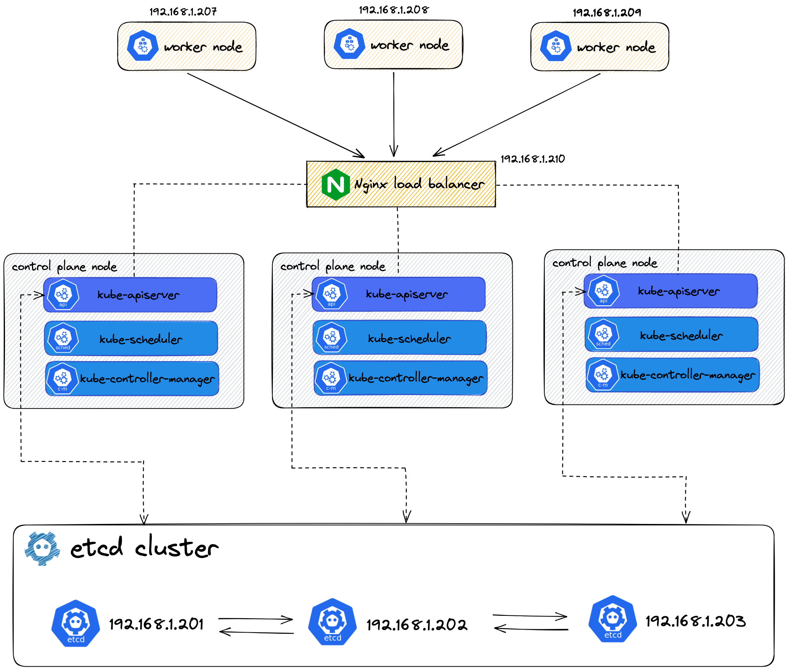

# 1. Kubernetes集群中的证书类别简介

## 1.1. 私有CA证书

作用于一个K8s集群范围内的私有CA证书，是各组件之间的信任主体。本文档中通过cfssl来创建。

## 1.2. etcd证书

用于组建etcd节点的证书。通常是将所有etcd节点的ip地址写入csr进行签发，从而达到一张证书供所有节点使用（当然，喜欢折腾的话，可以给每个节点单独签）。

## 1.3. kube-apiserver证书

分为服务端证书和客户端证书。

- kube-apiserver 服务端证书，用于和kube user、kubelet、kube-scheduler等客户端的会话

- kube-apiserver 的客户端证书，用于和 kubelet 的会话
- kube-apiserver 的客户端证书，用于和 etcd 的会话

通常是签一张kube-apiserver证书作为服务端、客户端证书使用，而不是分别签发kube-apiserver的服务端、客户端两张证书（当然，喜欢折腾的话也可以分开签）。

## 1.4. kubelet证书

分为服务端证书和客户端证书。

- kubelet 的[服务端证书](https://kubernetes.io/zh-cn/docs/reference/access-authn-authz/kubelet-tls-bootstrapping/#client-and-serving-certificates)， 用于 kube-apiserver 与 kubelet 的会话

- kubelet 的客户端证书，用于 kube-apiserver 的身份验证

和kube-apiserver一样，通常是签一张kubelet证书作为服务端、客户端证书使用，而不是分别签发kubelet的服务端、客户端两张证书。

## 1.5. kube-controller-manager证书

kube-controller-manager的客户端证书，通常写入kubeconfig文件中，用于和kube-apiserver的会话。

## 1.6. kube-scheduler证书

kube-scheduler的客户端证书，通常写入kubeconfig文件中，用于和 kube-apiserver的会话。

## 1.7 K8s集群管理员证书

K8s集群管理员的客户端证书，用于 kube-apiserver 身份认证并操作K8s集群。典型用法：配置给kubectl工具。

&nbsp;

&nbsp;

# 2. 机器规划

## 2.1. operation-machine

| 主机名            | IP地址        | 备注                                                         |
| ----------------- | ------------- | ------------------------------------------------------------ |
| operation-machine | 192.168.1.200 | 操作机 —— 用来签发k8s组件所需的证书、配置kubectl客户端等、作为时间同步服务器。 |

## 2.2. etcd

| 主机名  | IP地址        |
| ------- | ------------- |
| etcd-01 | 192.168.1.201 |
| etcd-02 | 192.168.1.202 |
| etcd-03 | 192.168.1.203 |

## 2.3. k8s master

| 主机名        | IP地址        |
| ------------- | ------------- |
| k8s-master-01 | 192.168.1.204 |

## 2.4. k8s nodes

| 主机名      | IP地址        |
| ----------- | ------------- |
| k8s-node-01 | 192.168.1.207 |
| k8s-node-02 | 192.168.1.208 |
| k8s-node-03 | 192.168.1.209 |

## 2.5. 系统约定

本文档使用Ubuntu 22系统，**每台机器**上统一使用kube用户及用户组，并且kube用户拥有sudo权限。

## 2.6. 文件目录约定

约定如下目录：

| 路径                       | 作用                                                         | 备注                                                  |
| -------------------------- | ------------------------------------------------------------ | ----------------------------------------------------- |
| /opt/kubernetes/bin        | 存放k8s集群相关的二进制，包括k8s组件、容器运行时、CNI等。    | 每台机器上都要创建，且该路径要添加到$PATH环境变量内。 |
| /opt/kubernetes/pki        | 存放k8s集群所有相关的ca证书。并且应当用表意的目录名分类存放，如：/opt/kubernetes/pki/etcd/cert，/opt/kubernetes/pki/kube-apiserver/cert。 | 每台机器上都要创建。                                  |
| /var/etcd/data             | etcd数据目录                                                 | 仅在etcd机器上创建                                    |
| /var/etcd/wal              | etcd wal数据目录                                             | 仅在etcd机器上创建                                    |
| /opt/kubernetes/kubeconfig | 存放k8s各组件的kubeconfig文件。如kube-scheduler、kube-controller-manager等。但是kubectl的kubeconfig文件应当放在~/.kube目录下 | 仅在k8s master、k8s nodes机器上创建                   |
| /var/lib/kubelet           | kubelet数据目录                                              | 仅在k8s node机器上创建                                |
| /var/lib/kube-proxy        | kube-proxy配置文件                                           | 仅在k8s node机器上创建                                |
| /etc/containerd            | containerd配置文件目录。containerd默认使用该位置配置文件：/etc/containerd/config.toml。 | 仅在k8s node机器上创建                                |
| /etc/cni/net.d             | 基础cni插件配置文件目录                                      | 仅在k8s node机器上创建                                |

&nbsp;

&nbsp;

# 3. K8s集群规划

<table>
  <tr>
    <td>
      <strong>Service IP范围</strong>
    </td>
    <td>
      10.68.0.0/16
    </td>
  </tr>
  <tr>
    <td>
      <strong>Pod IP 范围</strong>
    </td>
    <td>
      172.20.0.0/16
    </td>
  </tr>
  <tr>
    <td>
      <strong>容器运行时</strong>
    </td>
    <td>
      containerd
    </td>
  </tr>
  <tr>
    <td>
      <strong>网络插件</strong>
    </td>
    <td>
      Calico
    </td>
  </tr>
  <tr>
    <td>
      <strong>DNS插件</strong>
    </td>
    <td>
      CoreDNS
    </td>
  </tr>
  <tr>
    <td>
      <strong>kube-proxy 工作模式</strong>
    </td>
    <td>
      ipvs
    </td>
  </tr>
</table>
&nbsp;

&nbsp;

# 4. 整体架构

&nbsp;

&nbsp;

# 5. 参考

1. [Options for Highly Available Topology | Kubernetes](https://kubernetes.io/docs/setup/production-environment/tools/kubeadm/ha-topology/)
2. [PKI certificates and requirements](https://kubernetes.io/docs/setup/best-practices/certificates/)
